# Image credits

<table>
  <tr>
    <td>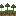&nbsp;&nbsp;<a href="biomes/">biomes/*</a></td>
    <td><a href="https://www.curseforge.com/minecraft/texture-packs/faithless">StitchSprites[^1]</a></td>
  </tr>
  <tr>
    <td>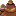&nbsp;&nbsp;<a href="biomes/badlands.png">biomes/badlands.png</a></td>
    <td>selfmade</td>
  </tr>
  <tr>
    <td>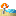&nbsp;&nbsp;<a href="biomes/beach.png">biomes/beach.png</a></td>
    <td><a href="https://stock.adobe.com/de/494050871">Adobe Stock (thepolovinkin)</a></td>
  </tr>
  <tr>
    <td>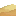&nbsp;&nbsp;<a href="biomes/desert.png">biomes/desert.png</a></td>
    <td>selfmade</td>
  </tr>
  <tr>
    <td>&nbsp;&nbsp;<a href="biomes/ice_spikes.png">biomes/ice_spikes.png</a></td>
    <td><a href="https://www.reddit.com/r/PixelArt/comments/9p1h7z/crystals/">[Unbekannt]</a></td>
  </tr>
  <tr>
    <td>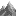&nbsp;&nbsp;<a href="biomes/">biomes/*mountains.png</a></td>
    <td>selfmade</td>
  </tr>
  <tr>
    <td>&nbsp;&nbsp;<a href="biomes/ocean.png">biomes/ocean.png</a></td>
    <td><a href="https://stock.adobe.com/de/494050871">Adobe Stock (thepolovinkin)</a></td>
  </tr>
  <tr>
    <td>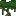&nbsp;&nbsp;<a href="biomes/swamp.png">biomes/swamp.png</a></td>
    <td>selfmade</td>
  </tr>
  <tr>
    <td>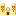&nbsp;&nbsp;<a href="structures/desert_pyramid.png">structures/desert_pyramid.png</a></td>
    <td><a href="https://minecraft.wiki/images/EnvSprite_desert-pyramid.png?aed9b">Minecraft Wiki</a></td>
  </tr>
  <tr>
    <td>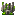&nbsp;&nbsp;<a href="structures/jungle_temple.png">structures/jungle_temple.png</a></td>
    <td>selfmade</td>
  </tr>
  <tr>
    <td>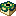&nbsp;&nbsp;<a href="structures/stronghold.png">structures/stronghold.png</a></td>
    <td><a href="https://www.curseforge.com/minecraft/texture-packs/faithless">StitchSprites</a></td>
  </tr>
  <tr>
    <td>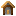&nbsp;&nbsp;<a href="structures/village.png">structures/village.png</a></td>
    <td>selfmade</td>
  </tr>
  <tr>
    <td>&nbsp;&nbsp;<a href="booster/">booster/*</a></td>
    <td><a href="https://www.planetminecraft.com/texture-pack/88classic-8x8/">88Classic (1Allexx1)</a></td>
  </tr>
  <tr>
    <td>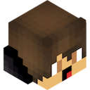&nbsp;&nbsp;<a href="high_res/credits/">high_res/credits/*</a></td>
    <td>selfmade</td>
  </tr>
  <tr>
    <td>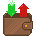&nbsp;&nbsp;<a href="high_res/wallets/">high_res/wallets/*</a></td>
    <td><a href="https://www.shutterstock.com/image-vector/pixel-art-game-cash-money-icons-2197122619">Shutterstock (NSTIvectors)</a></td>
  </tr>
  <tr>
    <td>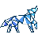&nbsp;&nbsp;<a href="high_res/byte_and_bit.png">high_res/byte_and_bit.png</a></td>
    <td><a href="https://byteandbit.store/">ByteAndBit Studio</a></td>
  </tr>
  <tr>
    <td>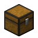&nbsp;&nbsp;<a href="high_res/chest.png">high_res/chest.png</a></td>
    <td><a href="https://assets.mcasset.cloud/1.21.11/assets/minecraft/textures/entity/chest/normal.png">Minecraft asset</a></td>
  </tr>
  <tr>
    <td>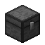&nbsp;&nbsp;<a href="high_res/chest_gray.png">high_res/chest_gray.png</a></td>
    <td><a href="https://assets.mcasset.cloud/1.21.11/assets/minecraft/textures/entity/chest/normal.png">Minecraft asset</a></td>
  </tr>
  <tr>
    <td>&nbsp;&nbsp;<a href="high_res/griefer_info.png">high_res/griefer_info.png</a></td>
    <td><a href="https://www.griefer.info/img/block.png">GrieferInfo</a></td>
  </tr>
  <tr>
    <td>&nbsp;&nbsp;<a href="high_res/icon.png">high_res/icon.png</a></td>
    <td>selfmade</td>
  </tr>
  <tr>
    <td>&nbsp;&nbsp;<a href="high_res/pencil_vec.png">high_res/pencil_vec.png</a></td>
    <td><a href="https://phosphoricons.com/">Phosphor Icons (pencil, Fill)</a></td>
  </tr>
  <tr>
    <td>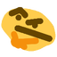&nbsp;&nbsp;<a href="high_res/thonk.png">high_res/thonk.png </a></td>
    <td><a href="https://cdn.discordapp.com/emojis/1075141032284524564.webp?size=128&quality=lossless">Discord emoji</a></td>
  </tr>
  <tr>
    <td>&nbsp;&nbsp;<a href="litematica/axes.png">litematica/axes.png</a></td>
    <td>selfmade</td>
  </tr>
  <tr>
    <td>&nbsp;&nbsp;<a href="litematica/green_highlight.png">litematica/green_highlight.png</a></td>
    <td>selfmade</td>
  </tr>
  <tr>
    <td>&nbsp;&nbsp;<a href="litematica/litematica.png">litematica/litematica.png</a></td>
    <td><a href="https://github.com/maruohon/litematica/blob/54343aa6a4eaf71fb7a6ab38dd5c72ed3bf1b897/src/main/resources/assets/litematica/icon.png">Litematica (SuperDragonite2172)</a></td>
  </tr>
  <tr>
    <td>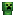&nbsp;&nbsp;<a href="mob_icons/faithless/">mob_icons/faithless/*</a></td>
    <td><a href="https://www.curseforge.com/minecraft/texture-packs/faithless">StitchSprites</a></td>
  </tr>
  <tr>
    <td>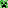&nbsp;&nbsp;<a href="mob_icons/minecraft/">mob_icons/minecraft/*</a></td>
    <td><a href="https://static.wikia.nocookie.net/minecraft_gamepedia/images/4/40/EntityCSS.png/revision/latest">Minecraft Fandom</a></td>
  </tr>
  <tr>
    <td>&nbsp;&nbsp;<a href="mob_icons/minecraft/mob.png">mob_icons/minecraft/mob.png</a></td>
    <td>selfmade</td>
  </tr>
  <tr>
    <td>&nbsp;&nbsp;<a href="mob_icons/outlined_minecraft/">mob_icons/outlined_minecraft/*</a></td>
    <td><a href="https://static.wikia.nocookie.net/minecraft_gamepedia/images/4/40/EntityCSS.png/revision/latest">Minecraft Fandom</a></td>
  </tr>
  <tr>
    <td>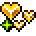&nbsp;&nbsp;<a href="absorption.png">absorption.png</a></td>
    <td><a href="https://github.com/StitchSprites/Faithless/blob/3abe2cb9f7c83ca9f781ab0287269fd413903ef7/assets/minecraft/textures/mob_effect/absorption.png">Faithless (StitchSprites)</a></td>
  </tr>
  <tr>
    <td>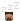&nbsp;&nbsp;<a href="afk_timer.png">afk_timer.png</a></td>
    <td><a href="https://labymod.net">LabyMod asset</a></td>
  </tr>
  <tr>
    <td>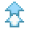&nbsp;&nbsp;<a href="arrows_up.png">arrows_up.png</a></td>
    <td><a href="https://assets.mcasset.cloud/1.21.11/assets/minecraft/textures/mob_effect/jump_boost.png">Minecraft asset</a></td>
  </tr>
  <tr>
    <td>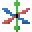&nbsp;&nbsp;<a href="axes.png">axes.png</a></td>
    <td><a href="https://minecraft.wiki/w/File:EnvSprite_map.png?b863e">Minecraft Wiki (Mudscape)</a>, <a href="https://labymod.net">LabyMod asset</a></td>
  </tr>
  <tr>
    <td>&nbsp;&nbsp;<a href="bank.png">bank.png</a></td>
    <td><a href="https://www.dreamstime.com/126816563">Dreamstime (Starserfer)</a></td>
  </tr>
  <tr>
    <td>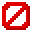&nbsp;&nbsp;<a href="barrier.png">barrier.png</a></td>
    <td><a href="https://assets.mcasset.cloud/1.21.11/assets/minecraft/textures/item/barrier.png">Minecraft asset</a></td>
  </tr>
  <tr>
    <td>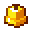&nbsp;&nbsp;<a href="bell.png">bell.png</a></td>
    <td><a href="https://github.com/StitchSprites/Faithless/blob/3abe2cb9f7c83ca9f781ab0287269fd413903ef7/assets/minecraft/textures/item/bell.png">Faithless (StitchSprites)</a></td>
  </tr>
  <tr>
    <td>&nbsp;&nbsp;<a href="blackboard.png">blackboard.png</a></td>
    <td><a href="https://minecraft.wiki/w/File:ItemSprite_board.png?9bd74">Minecraft Wiki (Mudscape)</a></td>
  </tr>
  <tr>
    <td>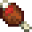&nbsp;&nbsp;<a href="bone_with_meat.png">bone_with_meat.png</a></td>
    <td><a href="https://assets.mcasset.cloud/1.21.11/assets/minecraft/textures/mob_effect/hunger.png">Minecraft asset</a></td>
  </tr>
  <tr>
    <td>&nbsp;&nbsp;<a href="book_and_quill.png">book_and_quill.png</a></td>
    <td><a href="https://minecraft.wiki/w/File:Ore_UI_-_%22Book_and_Quill%22_Icon_(Bedrock).png?6df6a">Minecraft Wiki (Seif Yasser100)</a></td>
  </tr>
  <tr>
    <td>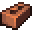&nbsp;&nbsp;<a href="brick.png">brick.png</a></td>
    <td><a href="https://github.com/StitchSprites/Faithless/blob/3abe2cb9f7c83ca9f781ab0287269fd413903ef7/assets/minecraft/textures/item/brick.png">Faithless (StitchSprites)</a></td>
  </tr>
  <tr>
    <td>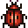&nbsp;&nbsp;<a href="bug.png">bug.png</a></td>
    <td><a href="https://www.freepik.com/premium-vector/insects-pixel-art-set-bugs-beetles-collection-8-bit-sprite_27501189.htm">Freepik (cadmium_red)</a></td>
  </tr>
  <tr>
    <td>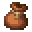&nbsp;&nbsp;<a href="bundle.png">bundle.png</a></td>
    <td><a href="https://assets.mcasset.cloud/1.21.11/assets/minecraft/textures/item/bundle.png">Minecraft asset</a></td>
  </tr>
  <tr>
    <td>&nbsp;&nbsp;<a href="calculator.png">calculator.png</a></td>
    <td><a href="https://apps.apple.com/us/app/calculator/id1069511488">Apple calculator</a></td>
  </tr>
  <tr>
    <td>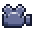&nbsp;&nbsp;<a href="camera.png">camera.png</a></td>
    <td><a href="https://labymod.net">LabyMod asset</a></td>
  </tr>
  <tr>
    <td>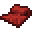&nbsp;&nbsp;<a href="carpet_red.png">carpet_red.png</a></td>
    <td><a href="https://github.com/StitchSprites/Faithless/blob/3abe2cb9f7c83ca9f781ab0287269fd413903ef7/assets/minecraft/textures/item/red_carpet.png">Faithless (StitchSprites)</a></td>
  </tr>
  <tr>
    <td>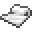&nbsp;&nbsp;<a href="carpet_white.png">carpet_white.png</a></td>
    <td><a href="https://github.com/StitchSprites/Faithless/blob/3abe2cb9f7c83ca9f781ab0287269fd413903ef7/assets/minecraft/textures/item/white_carpet.png">Faithless (StitchSprites)</a></td>
  </tr>
  <tr>
    <td>&nbsp;&nbsp;<a href="chat.png">chat.png</a></td>
    <td><a href="https://github.com/Aizistral-Studios/No-Chat-Reports/blob/99eb97f4559843a6bd839644af5669cfb5f1244e/src/main/resources/assets/nochatreports/textures/misc/ncr_logo.png">No Chat Reports (Aizistral)</a></td>
  </tr>
  <tr>
    <td>&nbsp;&nbsp;<a href="chat_orange.png">chat_orange.png</a></td>
    <td><a href="https://github.com/Aizistral-Studios/No-Chat-Reports/blob/99eb97f4559843a6bd839644af5669cfb5f1244e/src/main/resources/assets/nochatreports/textures/misc/ncr_logo.png">No Chat Reports (Aizistral)</a></td>
  </tr>
  <tr>
    <td>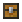&nbsp;&nbsp;<a href="chest.png">chest.png</a></td>
    <td><a href="https://minecraft-heads.com/custom-heads/head/100688-chest">Minecraft Heads (LtSarcasm)</a></td>
  </tr>
  <tr>
    <td>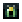&nbsp;&nbsp;<a href="chest_ender.png">chest_ender.png</a></td>
    <td><a href="https://minecraft-heads.com/custom-heads/head/228-ender-chest">Minecraft Heads (LordRazen)</a></td>
  </tr>
  <tr>
    <td>&nbsp;&nbsp;<a href="chest_golden.png">chest_golden.png</a></td>
    <td><a href="https://www.pixtastock.com/illustration/76636020">PIXTA Stock (zukky)</a></td>
  </tr>
  <tr>
    <td>&nbsp;&nbsp;<a href="clock.png">clock.png</a></td>
    <td><a href="https://assets.mcasset.cloud/1.21.11/assets/minecraft/textures/item/clock_00.png">Minecraft asset</a></td>
  </tr>
  <tr>
    <td>&nbsp;&nbsp;<a href="cog.png">cog.png</a></td>
    <td><a href="https://minecraft.wiki/w/File:Chat_settings_gear.png?6a179">Minecraft Wiki (LeftQuadrilateral)</a></td>
  </tr>
  <tr>
    <td>&nbsp;&nbsp;<a href="coin.png">coin.png</a></td>
    <td><a href="https://stock.adobe.com/de/images/golden-coins-pixel-art-set-medals-treasure-reward-stack-of-money-collection-8-bit-sprite-game-development-mobile-app-isolated-vector-illustration/494419772">Adobe Stock (SickleMoon)</a></td>
  </tr>
  <tr>
    <td>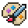&nbsp;&nbsp;<a href="color_palette.png">color_palette.png</a></td>
    <td><a href="https://minecraft.wiki/w/File:EnvSprite_color.png?32983">Minecraft Wiki (LeftQuadrilateral)</a></td>
  </tr>
  <tr>
    <td>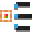&nbsp;&nbsp;<a href="command_menu.png">command_menu.png</a></td>
    <td><a href="https://labymod.net">LabyMod asset</a></td>
  </tr>
  <tr>
    <td>&nbsp;&nbsp;<a href="command_suggestions.png">command_suggestions.png</a></td>
    <td><a href="https://labymod.net">LabyMod asset</a></td>
  </tr>
  <tr>
    <td>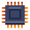&nbsp;&nbsp;<a href="cpu.png">cpu.png</a></td>
    <td><a href="https://www.shutterstock.com/image-vector/electronics-pixel-art-icons-set-artificial-1508310176">Shutterstock (VectorPixelStar)</a></td>
  </tr>
  <tr>
    <td>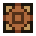&nbsp;&nbsp;<a href="crafting_table.png">crafting_table.png</a></td>
    <td><a href="https://minecraft.wiki/w/File:Ore_UI_-_%22Crafting_Table_Block%22_Icon_(Bedrock).png?9faaa">Minecraft Wiki (Seif Yasser100)</a></td>
  </tr>
  <tr>
    <td>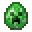&nbsp;&nbsp;<a href="creeper_spawn_egg.png">creeper_spawn_egg.png</a></td>
    <td><a href="https://assets.mcasset.cloud/1.21.11/assets/minecraft/textures/item/creeper_spawn_egg.png">Minecraft asset</a></td>
  </tr>
  <tr>
    <td>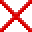&nbsp;&nbsp;<a href="crossed_out_block_outline.png">crossed_out_block_outline.png</a></td>
    <td><a href="https://modrinth.com/mod/antighost">Giselbaer</a></td>
  </tr>
  <tr>
    <td>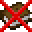&nbsp;&nbsp;<a href="crossed_out_book.png">crossed_out_book.png</a></td>
    <td><a href="https://assets.mcasset.cloud/1.21.11/assets/minecraft/textures/item/book.png">Minecraft asset</a></td>
  </tr>
  <tr>
    <td>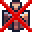&nbsp;&nbsp;<a href="crossed_out_book_read.png">crossed_out_book_read.png</a></td>
    <td><a href="https://labymod.net">LabyMod asset</a></td>
  </tr>
  <tr>
    <td>&nbsp;&nbsp;<a href="crossed_out_chat.png">crossed_out_chat.png</a></td>
    <td><a href="https://github.com/Aizistral-Studios/No-Chat-Reports/blob/99eb97f4559843a6bd839644af5669cfb5f1244e/src/main/resources/assets/nochatreports/textures/misc/ncr_logo.png">No Chat Reports (Aizistral)</a></td>
  </tr>
  <tr>
    <td>&nbsp;&nbsp;<a href="crossed_out_gold_ingot.png">crossed_out_gold_ingot.png</a></td>
    <td><a href="https://assets.mcasset.cloud/1.21.11/assets/minecraft/textures/item/gold_ingot.png">Minecraft asset</a></td>
  </tr>
  <tr>
    <td>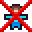&nbsp;&nbsp;<a href="crossed_out_mini_me.png">crossed_out_mini_me.png</a></td>
    <td><a href="https://labymod.net">LabyMod asset</a></td>
  </tr>
  <tr>
    <td>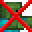&nbsp;&nbsp;<a href="crossed_out_zombie.png">crossed_out_zombie.png</a></td>
    <td><a href="https://github.com/StitchSprites/Faithless/blob/3abe2cb9f7c83ca9f781ab0287269fd413903ef7/assets/minecraft/textures/item/zombie_spawn_egg.png">Faithless (StitchSprites)</a></td>
  </tr>
  <tr>
    <td>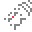&nbsp;&nbsp;<a href="crosshair.png">crosshair.png</a></td>
    <td><a href="https://labymod.net">LabyMod asset</a></td>
  </tr>
  <tr>
    <td>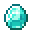&nbsp;&nbsp;<a href="diamond.png">diamond.png</a></td>
    <td><a href="https://assets.mcasset.cloud/1.21.11/assets/minecraft/textures/item/diamond.png">Minecraft asset</a></td>
  </tr>
  <tr>
    <td>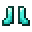&nbsp;&nbsp;<a href="diamond_boots.png">diamond_boots.png</a></td>
    <td><a href="https://assets.mcasset.cloud/1.21.11/assets/minecraft/textures/item/diamond_boots.png">Minecraft asset</a></td>
  </tr>
  <tr>
    <td>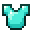&nbsp;&nbsp;<a href="diamond_chestplate.png">diamond_chestplate.png</a></td>
    <td><a href="https://assets.mcasset.cloud/1.21.11/assets/minecraft/textures/item/diamond_chestplate.png">Minecraft asset</a></td>
  </tr>
  <tr>
    <td>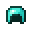&nbsp;&nbsp;<a href="diamond_helmet.png">diamond_helmet.png</a></td>
    <td><a href="https://assets.mcasset.cloud/1.21.11/assets/minecraft/textures/item/diamond_helmet.png">Minecraft asset</a></td>
  </tr>
  <tr>
    <td>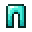&nbsp;&nbsp;<a href="diamond_leggings.png">diamond_leggings.png</a></td>
    <td><a href="https://assets.mcasset.cloud/1.21.11/assets/minecraft/textures/item/diamond_leggings.png">Minecraft asset</a></td>
  </tr>
  <tr>
    <td>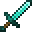&nbsp;&nbsp;<a href="diamond_sword.png">diamond_sword.png</a></td>
    <td><a href="https://assets.mcasset.cloud/1.21.11/assets/minecraft/textures/item/diamond_sword.png">Minecraft asset</a></td>
  </tr>
  <tr>
    <td>&nbsp;&nbsp;<a href="discord.png">discord.png</a></td>
    <td><a href="https://www.reddit.com/r/discordapp/comments/p6uzdt/discord_pixel_art_i_made/">Diamond_JMS</a></td>
  </tr>
  <tr>
    <td>&nbsp;&nbsp;<a href="discord_clyde.png">discord_clyde.png</a></td>
    <td><a href="Diamond_JMS">XREF</a></td>
  </tr>
  <tr>
    <td>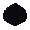&nbsp;&nbsp;<a href="dragon_egg.png">dragon_egg.png</a></td>
    <td><a href="https://assets.mcasset.cloud/1.21.11/assets/minecraft/textures/block/dragon_egg.png">Minecraft asset</a></td>
  </tr>
  <tr>
    <td>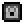&nbsp;&nbsp;<a href="dropper.png">dropper.png</a></td>
    <td><a href="https://minecraft-heads.com/custom-heads/head/232-dropper">Minecraft Heads (LordRazen)</a></td>
  </tr>
  <tr>
    <td>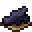&nbsp;&nbsp;<a href="dye_black.png">dye_black.png</a></td>
    <td><a href="https://assets.mcasset.cloud/1.21.11/assets/minecraft/textures/item/black_dye.png">Minecraft asset</a></td>
  </tr>
  <tr>
    <td>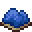&nbsp;&nbsp;<a href="dye_blue.png">dye_blue.png</a></td>
    <td><a href="https://assets.mcasset.cloud/1.21.11/assets/minecraft/textures/item/blue_dye.png">Minecraft asset</a></td>
  </tr>
  <tr>
    <td>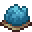&nbsp;&nbsp;<a href="dye_cyan.png">dye_cyan.png</a></td>
    <td><a href="https://assets.mcasset.cloud/1.21.11/assets/minecraft/textures/item/cyan_dye.png">Minecraft asset</a></td>
  </tr>
  <tr>
    <td>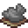&nbsp;&nbsp;<a href="dye_gray.png">dye_gray.png</a></td>
    <td><a href="https://assets.mcasset.cloud/1.21.11/assets/minecraft/textures/item/gray_dye.png">Minecraft asset</a></td>
  </tr>
  <tr>
    <td>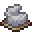&nbsp;&nbsp;<a href="dye_light_gray.png">dye_light_gray.png</a></td>
    <td><a href="https://assets.mcasset.cloud/1.21.11/assets/minecraft/textures/item/light_gray_dye.png">Minecraft asset</a></td>
  </tr>
  <tr>
    <td>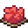&nbsp;&nbsp;<a href="dye_red.png">dye_red.png</a></td>
    <td><a href="https://assets.mcasset.cloud/1.21.11/assets/minecraft/textures/item/red_dye.png">Minecraft asset</a></td>
  </tr>
  <tr>
    <td>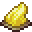&nbsp;&nbsp;<a href="dye_yellow.png">dye_yellow.png</a></td>
    <td><a href="https://assets.mcasset.cloud/1.21.11/assets/minecraft/textures/item/yellow_dye.png">Minecraft asset</a></td>
  </tr>
  <tr>
    <td>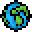&nbsp;&nbsp;<a href="earth.png">earth.png</a></td>
    <td><a href="https://www.dreamstime.com/129325507">Dreamstime (Tsipilevin)</a></td>
  </tr>
  <tr>
    <td>&nbsp;&nbsp;<a href="earth_grid.png">earth_grid.png</a></td>
    <td><a href="https://labymod.net">LabyMod asset</a></td>
  </tr>
  <tr>
    <td>&nbsp;&nbsp;<a href="easy_place_overlay.png">easy_place_overlay.png</a></td>
    <td><a href="https://www.freepik.com/premium-vector/pixel-art-video-game-direction-arrow-button-direction-key-vector-icon-8bit-game_33215958.htm">Freepik (kaleb-silva)</a></td>
  </tr>
  <tr>
    <td>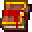&nbsp;&nbsp;<a href="enchanted_book.png">enchanted_book.png</a></td>
    <td><a href="https://github.com/StitchSprites/Faithless/blob/3abe2cb9f7c83ca9f781ab0287269fd413903ef7/assets/minecraft/textures/item/enchanted_book.png">Faithless (StitchSprites)</a></td>
  </tr>
  <tr>
    <td>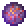&nbsp;&nbsp;<a href="enchanted_fire_charge.png">enchanted_fire_charge.png</a></td>
    <td><a href="https://assets.mcasset.cloud/1.21.11/assets/minecraft/textures/item/fire_charge.png">Minecraft asset</a></td>
  </tr>
  <tr>
    <td>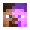&nbsp;&nbsp;<a href="enchanted_steve.png">enchanted_steve.png</a></td>
    <td><a href="https://assets.mcasset.cloud/1.19.2/assets/minecraft/textures/entity/steve.png">Minecraft asset</a></td>
  </tr>
  <tr>
    <td>&nbsp;&nbsp;<a href="eye_black.png">eye_black.png</a></td>
    <td><a href="https://labymod.net">LabyMod asset</a></td>
  </tr>
  <tr>
    <td>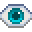&nbsp;&nbsp;<a href="eye_light_blue.png">eye_light_blue.png</a></td>
    <td><a href="https://labymod.net">LabyMod asset</a></td>
  </tr>
  <tr>
    <td>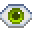&nbsp;&nbsp;<a href="eye_lime.png">eye_lime.png</a></td>
    <td><a href="https://labymod.net">LabyMod asset</a></td>
  </tr>
  <tr>
    <td>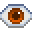&nbsp;&nbsp;<a href="eye_orange.png">eye_orange.png</a></td>
    <td><a href="https://labymod.net">LabyMod asset</a></td>
  </tr>
  <tr>
    <td>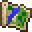&nbsp;&nbsp;<a href="filled_map.png">filled_map.png</a></td>
    <td><a href="https://github.com/StitchSprites/Faithless/blob/3abe2cb9f7c83ca9f781ab0287269fd413903ef7/assets/minecraft/textures/item/filled_map.png">Faithless (StitchSprites)</a></td>
  </tr>
  <tr>
    <td>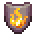&nbsp;&nbsp;<a href="fire_resistance.png">fire_resistance.png</a></td>
    <td><a href="https://assets.mcasset.cloud/1.21.11/assets/minecraft/textures/mob_effect/fire_resistance.png">Minecraft asset</a></td>
  </tr>
  <tr>
    <td>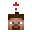&nbsp;&nbsp;<a href="firework_on_head.png">firework_on_head.png</a></td>
    <td><a href="https://assets.mcasset.cloud/1.21.11/assets/minecraft/textures/item/firework_rocket.png">Minecraft asset</a>, <a href="https://assets.mcasset.cloud/1.19.2/assets/minecraft/textures/entity/steve.png">Minecraft asset</a></td>
  </tr>
  <tr>
    <td>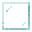&nbsp;&nbsp;<a href="glass_pane.png">glass_pane.png</a></td>
    <td><a href="https://assets.mcasset.cloud/1.21.11/assets/minecraft/textures/block/glass.png">Minecraft asset</a></td>
  </tr>
  <tr>
    <td>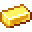&nbsp;&nbsp;<a href="gold_ingot.png">gold_ingot.png</a></td>
    <td><a href="https://assets.mcasset.cloud/1.21.11/assets/minecraft/textures/item/gold_ingot.png">Minecraft asset</a></td>
  </tr>
  <tr>
    <td>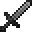&nbsp;&nbsp;<a href="gray_sword.png">gray_sword.png</a></td>
    <td><a href="https://assets.mcasset.cloud/1.21.11/assets/minecraft/textures/item/diamond_sword.png">Minecraft asset</a></td>
  </tr>
  <tr>
    <td>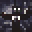&nbsp;&nbsp;<a href="griefer_games.png">griefer_games.png</a></td>
    <td><a href="https://griefergames.de/img/icon/apple-touch-icon.png">GrieferGames</a></td>
  </tr>
  <tr>
    <td>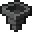&nbsp;&nbsp;<a href="hopper.png">hopper.png</a></td>
    <td><a href="https://github.com/StitchSprites/Faithless/blob/3abe2cb9f7c83ca9f781ab0287269fd413903ef7/assets/minecraft/textures/item/hopper.png">Faithless (StitchSprites)</a></td>
  </tr>
  <tr>
    <td>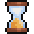&nbsp;&nbsp;<a href="hourglass.png">hourglass.png</a></td>
    <td><a href="https://stock.adobe.com/nl/images/hourglass-pixel-art-icon-design-for-logo-web-mobile-app-sticker-badges-and-patches-video-game-sprite-8-bit-isolated-vector-illustration/497532506">Adobe Stock (thepolovinkin)</a></td>
  </tr>
  <tr>
    <td>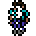&nbsp;&nbsp;<a href="invisibility.png">invisibility.png</a></td>
    <td><a href="https://assets.mcasset.cloud/1.13.2/assets/minecraft/textures/gui/container/inventory.png">Minecraft asset</a></td>
  </tr>
  <tr>
    <td>&nbsp;&nbsp;<a href="iron_bars.png">iron_bars.png</a></td>
    <td><a href="https://github.com/StitchSprites/Faithless/blob/3abe2cb9f7c83ca9f781ab0287269fd413903ef7/assets/minecraft/textures/item/iron_bars.png">Faithless (StitchSprites)</a></td>
  </tr>
  <tr>
    <td>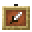&nbsp;&nbsp;<a href="item_frame.png">item_frame.png</a></td>
    <td><a href="https://assets.mcasset.cloud/1.21.11/assets/minecraft/textures/item/item_frame.png">Minecraft asset</a></td>
  </tr>
  <tr>
    <td>&nbsp;&nbsp;<a href="key.png">key.png</a></td>
    <td><a href="https://www.freepik.com/premium-vector/retro-pixel-art-video-game-ui-buttons-collection_422685808.htm">Freepik (nicesonlab)</a></td>
  </tr>
  <tr>
    <td>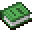&nbsp;&nbsp;<a href="knowledge_book.png">knowledge_book.png</a></td>
    <td><a href="https://assets.mcasset.cloud/1.21.11/assets/minecraft/textures/item/knowledge_book.png">Minecraft asset</a></td>
  </tr>
  <tr>
    <td>&nbsp;&nbsp;<a href="ko_fi.png">ko_fi.png</a></td>
    <td><a href="https://more.ko-fi.com/brand-assets">Ko-fi</a></td>
  </tr>
  <tr>
    <td>&nbsp;&nbsp;<a href="ko_fi_outline.png">ko_fi_outline.png</a></td>
    <td><a href="https://more.ko-fi.com/brand-assets">Ko-fi</a></td>
  </tr>
  <tr>
    <td>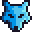&nbsp;&nbsp;<a href="labymod.png">labymod.png</a></td>
    <td><a href="https://labymod.net">LabyMod asset</a></td>
  </tr>
  <tr>
    <td>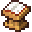&nbsp;&nbsp;<a href="lectern.png">lectern.png</a></td>
    <td><a href="https://github.com/StitchSprites/Faithless/blob/3abe2cb9f7c83ca9f781ab0287269fd413903ef7/assets/minecraft/textures/item/lectern.png">Faithless (StitchSprites)</a></td>
  </tr>
  <tr>
    <td>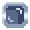&nbsp;&nbsp;<a href="lens.png">lens.png</a></td>
    <td><a href="https://www.shutterstock.com/image-vector/772538452">Shutterstock (VectorPixelStar)</a></td>
  </tr>
  <tr>
    <td>&nbsp;&nbsp;<a href="light_bulb.png">light_bulb.png</a></td>
    <td><a href="https://www.istockphoto.com/de/vektor/472679974-63963289">iStock (karpenko_ilia)</a></td>
  </tr>
  <tr>
    <td>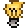&nbsp;&nbsp;<a href="light_bulb_glitch.png">light_bulb_glitch.png</a></td>
    <td><a href="https://www.istockphoto.com/de/vektor/472679974-63963289">iStock (karpenko_ilia)</a></td>
  </tr>
  <tr>
    <td>&nbsp;&nbsp;<a href="lightning.png">lightning.png</a></td>
    <td><a href="https://www.freepik.com/premium-vector/vector-illustration-cute-pixel-art-icon-geek-lightning-element-style-90s-game_29366701.htm">Freepik (Olive Kitt)</a></td>
  </tr>
  <tr>
    <td>&nbsp;&nbsp;<a href="loop.png">loop.png</a></td>
    <td><a href="https://labymod.net">LabyMod asset</a></td>
  </tr>
  <tr>
    <td>&nbsp;&nbsp;<a href="lucky_block.png">lucky_block.png</a></td>
    <td><a href="https://github.com/alexsocha/luckyblock/blob/b961ecd855446c46af65219ce52ffa75c359742e/common/src/main/resources/game/assets/lucky/textures/block/lucky_block.png">Lucky Block (Alex Socha)</a></td>
  </tr>
  <tr>
    <td>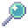&nbsp;&nbsp;<a href="magnifying_glass.png">magnifying_glass.png</a></td>
    <td><a href="https://labymod.net">LabyMod asset</a></td>
  </tr>
  <tr>
    <td>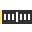&nbsp;&nbsp;<a href="measurement.png">measurement.png</a></td>
    <td><a href="https://labymod.net">LabyMod asset</a></td>
  </tr>
  <tr>
    <td>&nbsp;&nbsp;<a href="measurement_circle_thingy.png">measurement_circle_thingy.png</a></td>
    <td><a href="https://labymod.net">LabyMod asset</a></td>
  </tr>
  <tr>
    <td>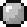&nbsp;&nbsp;<a href="menu_point.png">menu_point.png</a></td>
    <td><a href="https://labymod.net">LabyMod asset</a></td>
  </tr>
  <tr>
    <td>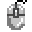&nbsp;&nbsp;<a href="mouse.png">mouse.png</a></td>
    <td><a href="https://labymod.net">LabyMod asset</a></td>
  </tr>
  <tr>
    <td>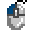&nbsp;&nbsp;<a href="mouse_left.png">mouse_left.png</a></td>
    <td><a href="https://labymod.net">LabyMod asset</a></td>
  </tr>
  <tr>
    <td>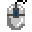&nbsp;&nbsp;<a href="mouse_middle.png">mouse_middle.png</a></td>
    <td><a href="https://labymod.net">LabyMod asset</a></td>
  </tr>
  <tr>
    <td>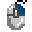&nbsp;&nbsp;<a href="mouse_right.png">mouse_right.png</a></td>
    <td><a href="https://labymod.net">LabyMod asset</a></td>
  </tr>
  <tr>
    <td>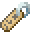&nbsp;&nbsp;<a href="name_tag.png">name_tag.png</a></td>
    <td><a href="https://assets.mcasset.cloud/1.21.11/assets/minecraft/textures/item/name_tag.png">Minecraft asset</a></td>
  </tr>
  <tr>
    <td>&nbsp;&nbsp;<a href="name_tag_rainbow.png">name_tag_rainbow.png</a></td>
    <td><a href="https://labymod.net">LabyMod asset</a></td>
  </tr>
  <tr>
    <td>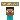&nbsp;&nbsp;<a href="name_tag_yellow.png">name_tag_yellow.png</a></td>
    <td><a href="https://labymod.net">LabyMod asset</a></td>
  </tr>
  <tr>
    <td>&nbsp;&nbsp;<a href="open_book.png">open_book.png</a></td>
    <td><a href="https://stock.adobe.com/es/images/different-books-pixel-art-set-fantasy-tome-folio-collection-open-closed-textbooks-8-bit-sprite-game-development-mobile-app-isolated-vector-illustration/502502076">Adobe Stock (SickleMoon)</a></td>
  </tr>
  <tr>
    <td>&nbsp;&nbsp;<a href="open_book_outline.png">open_book_outline.png</a></td>
    <td><a href="https://stock.adobe.com/es/images/different-books-pixel-art-set-fantasy-tome-folio-collection-open-closed-textbooks-8-bit-sprite-game-development-mobile-app-isolated-vector-illustration/502502076">Adobe Stock (SickleMoon)</a></td>
  </tr>
  <tr>
    <td>&nbsp;&nbsp;<a href="open_link.png">open_link.png</a></td>
    <td>selfmade</td>
  </tr>
  <tr>
    <td>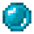&nbsp;&nbsp;<a href="orb.png">orb.png</a></td>
    <td><a href="https://www.deviantart.com/bronzefish678/art/Pixel-orb-thing-245073608">DeviantArt (bronzefish678)</a></td>
  </tr>
  <tr>
    <td>&nbsp;&nbsp;<a href="orbseller.png">orbseller.png</a></td>
    <td><a href="https://textures.minecraft.net/texture/ef686fbf016e1458f7f9a9850f38ef7fd6ae1d28bc241ac0c0686f77fdbb4b61">Minecraft Skin</a></td>
  </tr>
  <tr>
    <td>&nbsp;&nbsp;<a href="particle.png">particle.png</a></td>
    <td><a href="https://assets.mcasset.cloud/1.8.9/assets/minecraft/textures/particle/particles.png">Minecraft asset</a></td>
  </tr>
  <tr>
    <td>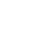&nbsp;&nbsp;<a href="pencil.png">pencil.png</a></td>
    <td>selfmade</td>
  </tr>
  <tr>
    <td>&nbsp;&nbsp;<a href="pencil_padded.png">pencil_padded.png</a></td>
    <td>selfmade</td>
  </tr>
  <tr>
    <td>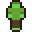&nbsp;&nbsp;<a href="player_green.png">player_green.png</a></td>
    <td><a href="https://labymod.net">LabyMod asset</a></td>
  </tr>
  <tr>
    <td>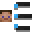&nbsp;&nbsp;<a href="player_menu.png">player_menu.png</a></td>
    <td><a href="https://labymod.net">LabyMod asset</a></td>
  </tr>
  <tr>
    <td>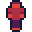&nbsp;&nbsp;<a href="player_red.png">player_red.png</a></td>
    <td><a href="https://labymod.net">LabyMod asset</a></td>
  </tr>
  <tr>
    <td>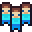&nbsp;&nbsp;<a href="players.png">players.png</a></td>
    <td><a href="https://labymod.net">LabyMod asset</a></td>
  </tr>
  <tr>
    <td>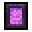&nbsp;&nbsp;<a href="portal.png">portal.png</a></td>
    <td><a href="https://minecraft.wiki/w/File:EnvSprite_nether-portal.png?47646">Minecraft Wiki (Mudscape)</a></td>
  </tr>
  <tr>
    <td>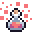&nbsp;&nbsp;<a href="potion.png">potion.png</a></td>
    <td><a href="https://labymod.net">LabyMod asset</a></td>
  </tr>
  <tr>
    <td>&nbsp;&nbsp;<a href="qr_code.png">qr_code.png</a></td>
    <td><a href="https://www.vecteezy.com/vector-art/21467452-qr-code-icon-bar-code-symbol-simple-code-sign-vector-illustration">Vecteezy (Evolvect)</a></td>
  </tr>
  <tr>
    <td>&nbsp;&nbsp;<a href="recording_red.png">recording_red.png</a></td>
    <td>selfmade</td>
  </tr>
  <tr>
    <td>&nbsp;&nbsp;<a href="recording_white.png">recording_white.png</a></td>
    <td>selfmade</td>
  </tr>
  <tr>
    <td>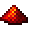&nbsp;&nbsp;<a href="redstone.png">redstone.png</a></td>
    <td><a href="https://github.com/StitchSprites/Faithless/blob/3abe2cb9f7c83ca9f781ab0287269fd413903ef7/assets/minecraft/textures/item/redstone.png">Faithless (StitchSprites)</a></td>
  </tr>
  <tr>
    <td>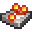&nbsp;&nbsp;<a href="redstone_comparator.png">redstone_comparator.png</a></td>
    <td><a href="https://github.com/StitchSprites/Faithless/blob/3abe2cb9f7c83ca9f781ab0287269fd413903ef7/assets/minecraft/textures/item/comparator.png">Faithless (StitchSprites)</a></td>
  </tr>
  <tr>
    <td>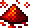&nbsp;&nbsp;<a href="redstone_particles.png">redstone_particles.png</a></td>
    <td><a href="https://github.com/StitchSprites/Faithless/blob/3abe2cb9f7c83ca9f781ab0287269fd413903ef7/assets/minecraft/textures/item/redstone.png">Faithless (StitchSprites)</a></td>
  </tr>
  <tr>
    <td>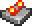&nbsp;&nbsp;<a href="redstone_repeater.png">redstone_repeater.png</a></td>
    <td><a href="https://github.com/StitchSprites/Faithless/blob/3abe2cb9f7c83ca9f781ab0287269fd413903ef7/assets/minecraft/textures/item/repeater.png">Faithless (StitchSprites)</a></td>
  </tr>
  <tr>
    <td>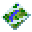&nbsp;&nbsp;<a href="region_map.png">region_map.png</a></td>
    <td><a href="https://minecraft.wiki/w/File:ItemSprite_locked-map.png?c4112">Minecraft Wiki (Mudscape)</a></td>
  </tr>
  <tr>
    <td>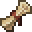&nbsp;&nbsp;<a href="scroll.png">scroll.png</a></td>
    <td><a href="https://github.com/StitchSprites/Faithless/blob/3abe2cb9f7c83ca9f781ab0287269fd413903ef7/assets/minecraft/textures/item/map.png">Faithless (StitchSprites)</a></td>
  </tr>
  <tr>
    <td>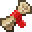&nbsp;&nbsp;<a href="scroll_red.png">scroll_red.png</a></td>
    <td><a href="https://github.com/StitchSprites/Faithless/blob/3abe2cb9f7c83ca9f781ab0287269fd413903ef7/assets/minecraft/textures/item/map.png">Faithless (StitchSprites)</a>, <a href="https://www.vectorstock.com/royalty-free-vector/paper-scroll-pixel-art-with-red-ribbon-vector-46572164">VectorStock (ad_stock)</a></td>
  </tr>
  <tr>
    <td>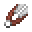&nbsp;&nbsp;<a href="shears.png">shears.png</a></td>
    <td><a href="https://assets.mcasset.cloud/1.21.11/assets/minecraft/textures/item/shears.png">Minecraft asset</a></td>
  </tr>
  <tr>
    <td>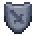&nbsp;&nbsp;<a href="shield_with_sword.png">shield_with_sword.png</a></td>
    <td><a href="https://assets.mcasset.cloud/1.21.11/assets/minecraft/textures/mob_effect/resistance.png">Minecraft asset</a></td>
  </tr>
  <tr>
    <td>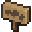&nbsp;&nbsp;<a href="sign.png">sign.png</a></td>
    <td><a href="https://github.com/StitchSprites/Faithless/blob/3abe2cb9f7c83ca9f781ab0287269fd413903ef7/assets/minecraft/textures/item/oak_sign.png">Faithless (StitchSprites)</a></td>
  </tr>
  <tr>
    <td>&nbsp;&nbsp;<a href="skull.png">skull.png</a></td>
    <td>selfmade</td>
  </tr>
  <tr>
    <td>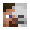&nbsp;&nbsp;<a href="skull_steve.png">skull_steve.png</a></td>
    <td><a href="https://assets.mcasset.cloud/1.21.11/assets/minecraft/textures/entity/skeleton/skeleton.png">Minecraft asset</a>, <a href="https://assets.mcasset.cloud/1.19.2/assets/minecraft/textures/entity/steve.png">Minecraft asset</a></td>
  </tr>
  <tr>
    <td>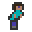&nbsp;&nbsp;<a href="sneaking.png">sneaking.png</a></td>
    <td><a href="https://minecraft.wiki/w/File:EnvSprite_sneak.png?c2821">Minecraft Wiki (Mudscape)</a></td>
  </tr>
  <tr>
    <td>&nbsp;&nbsp;<a href="sounds.png">sounds.png</a></td>
    <td><a href="https://minecraft.wiki/w/File:EnvSprite_ambience.png?d7c92">Minecraft Wiki (Mudscape)</a></td>
  </tr>
  <tr>
    <td>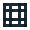&nbsp;&nbsp;<a href="spawner.png">spawner.png</a></td>
    <td><a href="https://minecraft-heads.com/custom-heads/head/36418-spawner">Minecraft Heads (Ncxz)</a></td>
  </tr>
  <tr>
    <td>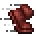&nbsp;&nbsp;<a href="speed.png">speed.png</a></td>
    <td><a href="https://assets.mcasset.cloud/1.21.11/assets/minecraft/textures/mob_effect/speed.png">Minecraft asset</a></td>
  </tr>
  <tr>
    <td>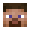&nbsp;&nbsp;<a href="steve.png">steve.png</a></td>
    <td><a href="https://assets.mcasset.cloud/1.19.2/assets/minecraft/textures/entity/steve.png">Minecraft asset</a></td>
  </tr>
  <tr>
    <td>&nbsp;&nbsp;<a href="tab_list.png">tab_list.png</a></td>
    <td><a href="https://labymod.net">LabyMod asset</a></td>
  </tr>
  <tr>
    <td>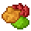&nbsp;&nbsp;<a href="tabping_colored.png">tabping_colored.png</a></td>
    <td><a href="https://labymod.net">LabyMod asset</a></td>
  </tr>
  <tr>
    <td>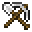&nbsp;&nbsp;<a href="tools.png">tools.png</a></td>
    <td><a href="https://minecraft.wiki/w/File:EnvSprite_item.png?89d23">Minecraft Wiki (Mudscape)</a></td>
  </tr>
  <tr>
    <td>&nbsp;&nbsp;<a href="transparent.png">transparent.png</a></td>
    <td>selfmade</td>
  </tr>
  <tr>
    <td>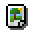&nbsp;&nbsp;<a href="tree_file.png">tree_file.png</a></td>
    <td><a href="https://labymod.net">LabyMod asset</a></td>
  </tr>
  <tr>
    <td>&nbsp;&nbsp;<a href="trophy.png">trophy.png</a></td>
    <td><a href="https://stock.adobe.com/de/images/winner-cups-gold-silver-and-bronze-pixel-art-icon-set-first-second-and-third-place-trophies-logo-collection-8-bit-sprite-game-development-mobile-app-isolated-vector-illustration/493281225">Adobe Stock (SickleMoon)</a></td>
  </tr>
  <tr>
    <td>&nbsp;&nbsp;<a href="twitch.png">twitch.png</a></td>
    <td><a href="https://emoji.gg/pack/50303-pixel-arts">emoji.gg (Luksy25)</a></td>
  </tr>
  <tr>
    <td>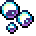&nbsp;&nbsp;<a href="water_breathing.png">water_breathing.png</a></td>
    <td><a href="https://github.com/StitchSprites/Faithless/blob/3abe2cb9f7c83ca9f781ab0287269fd413903ef7/assets/minecraft/textures/mob_effect/water_breathing.png">Faithless (StitchSprites)</a></td>
  </tr>
  <tr>
    <td>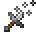&nbsp;&nbsp;<a href="weakness.png">weakness.png</a></td>
    <td><a href="https://assets.mcasset.cloud/1.21.11/assets/minecraft/textures/mob_effect/weakness.png">Minecraft asset</a></td>
  </tr>
  <tr>
    <td>&nbsp;&nbsp;<a href="wooden_board.png">wooden_board.png</a></td>
    <td><a href="https://labymod.net">LabyMod asset</a></td>
  </tr>
</table>
