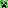
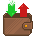
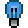
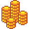
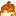
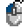
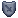
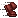

# Image credits

<table>
  <tr>
    <td>&nbsp;&nbsp;<a href="booster/">booster/*</a></td>
    <td><a href="https://www.planetminecraft.com/texture-pack/88classic-8x8/">88Classic (1Allexx1)</a></td>
  </tr>
  <tr>
    <td>&nbsp;&nbsp;<a href="credits/scroll.png">credits/scroll.png</a></td>
    <td><a href="https://web.archive.org/web/20221107162631/https://preview.pixlr.com/images/800wm/100/1/1001469300.jpg">Stock by Pixlr</a></td>
  </tr>
  <tr>
    <td>&nbsp;&nbsp;<a href="credits/">credits/*</a></td>
    <td>selfmade</td>
  </tr>
  <tr>
    <td>&nbsp;&nbsp;<a href="griefer_info/chest.png">griefer_info/chest.png</a></td>
    <td><a href="https://assets.mcasset.cloud/1.19.2/assets/minecraft/textures/entity/chest/normal.png">Minecraft asset</a></td>
  </tr>
  <tr>
    <td>&nbsp;&nbsp;<a href="griefer_info/chest_gray.png">griefer_info/chest_gray.png</a></td>
    <td><a href="https://assets.mcasset.cloud/1.19.2/assets/minecraft/textures/entity/chest/normal.png">Minecraft asset</a></td>
  </tr>
  <tr>
    <td>&nbsp;&nbsp;<a href="griefer_info/diamond_sword.png">griefer_info/diamond_sword.png</a></td>
    <td><a href="https://assets.mcasset.cloud/1.19.2/assets/minecraft/textures/item/diamond_sword.png">Minecraft asset</a></td>
  </tr>
  <tr>
    <td>&nbsp;&nbsp;<a href="griefer_info/gray_sword.png">griefer_info/gray_sword.png </a></td>
    <td><a href="https://assets.mcasset.cloud/1.19.2/assets/minecraft/textures/item/diamond_sword.png">Minecraft asset</a></td>
  </tr>
  <tr>
  <tr>
    <td>&nbsp;&nbsp;<a href="labymod_3/">labymod_3/*</a></td>
    <td><a href="https://labymod.net">LabyMod asset</a></td>
  </tr>
  <tr>
    <td>&nbsp;&nbsp;<a href="litematica/axes.png">litematica/axes.png</a></td>
    <td>selfmade</td>
  </tr>
  <tr>
    <td>&nbsp;&nbsp;<a href="litematica/green_highlight.png">litematica/green_highlight.png</a></td>
    <td>selfmade</td>
  </tr>
  <tr>
    <td>&nbsp;&nbsp;<a href="litematica/litematica.png">litematica/litematica.png</a></td>
    <td><a href="https://github.com/maruohon/litematica/blob/54343aa6a4eaf71fb7a6ab38dd5c72ed3bf1b897/src/main/resources/assets/litematica/icon.png">Litematica (SuperDragonite2172)</a></td>
  </tr>
  <tr>
    <td>&nbsp;&nbsp;<a href="mob_icons/faithless/">mob_icons/faithless/*</a></td>
    <td><a href="https://www.curseforge.com/minecraft/texture-packs/faithless">StitchSprites</a></td>
  </tr>
  <tr>
    <td>&nbsp;&nbsp;<a href="mob_icons/minecraft/">mob_icons/minecraft/*</a></td>
    <td><a href="https://static.wikia.nocookie.net/minecraft_gamepedia/images/4/40/EntityCSS.png/revision/latest">Minecraft Fandom</a></td>
  </tr>
  <tr>
    <td>&nbsp;&nbsp;<a href="mob_icons/outlined_minecraft/">mob_icons/outlined_minecraft/*</a></td>
    <td><a href="https://static.wikia.nocookie.net/minecraft_gamepedia/images/4/40/EntityCSS.png/revision/latest">Minecraft Fandom</a></td>
  </tr>
  <tr>
    <td>&nbsp;&nbsp;<a href="wallets/">wallets/* </a></td>
    <td><a href="https://www.shutterstock.com/image-vector/pixel-art-game-cash-money-icons-2197122619">Shutterstock (NSTIvectors)</a></td>
  </tr>
  <tr>
    <td>&nbsp;&nbsp;<a href="arrow_circle.png">arrow_circle.png</a></td>
    <td><a href="https://labymod.net">LabyMod asset</a></td>
  </tr>
  <tr>
    <td>&nbsp;&nbsp;<a href="bank.png">bank.png</a></td>
    <td><a href="https://www.dreamstime.com/126816563">Dreamstime (Starserfer)</a></td>
  </tr>
  <tr>
    <td>&nbsp;&nbsp;<a href="blindness.png">blindness.png</a></td>
    <td><a href="https://assets.mcasset.cloud/1.19.2/assets/minecraft/textures/mob_effect/blindness.png">Minecraft asset</a></td>
  </tr>
  <tr>
    <td>&nbsp;&nbsp;<a href="blue_graph.png">blue_graph.png</a></td>
    <td><a href="https://www.vecteezy.com/vector-art/6470596-falling-chart-pixel-art-business-icon">Vectezzy (Dooder)</a></td>
  </tr>
  <tr>
    <td>&nbsp;&nbsp;<a href="blue_light_bulb.png">blue_light_bulb.png</a></td>
    <td><a href="https://www.istockphoto.com/de/vektor/472679974-63963289">iStock (karpenko_ilia)</a></td>
  </tr>
  <tr>
    <td>&nbsp;&nbsp;<a href="bone_with_meat.png">bone_with_meat.png</a></td>
    <td><a href="https://assets.mcasset.cloud/1.19.2/assets/minecraft/textures/mob_effect/saturation.png">Minecraft asset</a></td>
  </tr>
  <tr>
    <td>&nbsp;&nbsp;<a href="broken_lock.png">broken_lock.png</a></td>
    <td><a href="https://www.freepik.com/premium-vector/door-lock-pixel-art-set-secure-lock-made-gold-steel-locked-unlocked-collection-8bit_25184624.htm">Freepik (cadmium_red)</a></td>
  </tr>
  <tr>
    <td>&nbsp;&nbsp;<a href="broken_pickaxe.png">broken_pickaxe.png</a></td>
    <td><a href="https://assets.mcasset.cloud/1.19.2/assets/minecraft/textures/gui/container/stats_icons.png">Minecraft asset</a></td>
  </tr>
  <tr>
    <td>&nbsp;&nbsp;<a href="bug.png">bug.png</a></td>
    <td><a href="https://www.freepik.com/premium-vector/insects-pixel-art-set-bugs-beetles-collection-8-bit-sprite_27501189.htm">Freepik (cadmium_red)</a></td>
  </tr>
  <tr>
    <td>&nbsp;&nbsp;<a href="bundle.png">bundle.png</a></td>
    <td><a href="https://assets.mcasset.cloud/1.19.2/assets/minecraft/textures/item/bundle_filled.png">Minecraft asset</a></td>
  </tr>
  <tr>
    <td>&nbsp;&nbsp;<a href="byte_and_bit.png">byte_and_bit.png</a></td>
    <td><a href="https://byteandbit.store/">ByteAndBit Studio</a></td>
  </tr>
  <tr>
    <td>&nbsp;&nbsp;<a href="calculator.png">calculator.png</a></td>
    <td><a href="https://apps.apple.com/us/app/calculator/id1069511488">Apple calculator</a></td>
  </tr>
  <tr>
    <td>&nbsp;&nbsp;<a href="camera.png">camera.png</a></td>
    <td><a href="https://www.shutterstock.com/de/image-vector/movie-camera-pixel-art-32-bit-2191871743">Shutterstock (pixelpnj)</a></td>
  </tr>
  <tr>
    <td>&nbsp;&nbsp;<a href="chest.png">chest.png</a></td>
    <td><a href="https://stock.adobe.com/de/images/set-of-pixel-boxes/192886298">Adobe Stock (Markov)</a></td>
  </tr>
  <tr>
    <td>&nbsp;&nbsp;<a href="chunk.png">chunk.png</a></td>
    <td><a href="https://www.deviantart.com/ishmanallenlitchmore/art/chunk-of-minecraft-382711453">DeviantArt (IshmanAllenLitchmore)</a></td>
  </tr>
  <tr>
    <td>&nbsp;&nbsp;<a href="clipboard.png">clipboard.png</a></td>
    <td><a href="https://www.shutterstock.com/image-vector/clipboard-icon-notes-clean-sheet-paper-1044834838">Shutterstock (VectorPixelStar)</a></td>
  </tr>
  <tr>
    <td>&nbsp;&nbsp;<a href="cog.png">cog.png</a></td>
    <td><a href="https://www.dreamstime.com/pixel-icon-cogwheel-pixel-icon-cogwheel-three-variants-fully-editable-image123561946">Dreamstime (Starserfer)</a></td>
  </tr>
  <tr>
    <td>&nbsp;&nbsp;<a href="coin_pile.png">coin_pile.png</a></td>
    <td><a href="https://www.shutterstock.com/image-vector/pixel-art-golden-coin-retro-video-1024225483">Shutterstock (Gamegfx)</a></td>
  </tr>
  <tr>
    <td>&nbsp;&nbsp;<a href="coin_pile_crossed_out.png">coin_pile_crossed_out.png</a></td>
    <td><a href="https://www.shutterstock.com/image-vector/pixel-art-golden-coin-retro-video-1024225483">Shutterstock (Gamegfx)</a></td>
  </tr>
  <tr>
    <td>&nbsp;&nbsp;<a href="command_pie_menu.png">command_pie_menu.png</a></td>
    <td><a href="https://labymod.net">LabyMod asset</a></td>
  </tr>
  <tr>
    <td>&nbsp;&nbsp;<a href="cpu.png">cpu.png</a></td>
    <td><a href="https://www.shutterstock.com/image-vector/electronics-pixel-art-icons-set-artificial-1508310176">Shutterstock (VectorPixelStar)</a></td>
  </tr>
  <tr>
    <td>&nbsp;&nbsp;<a href="crossed_out_block_outline.png">crossed_out_block_outline.png</a></td>
    <td><a href="https://modrinth.com/mod/antighost">Giselbaer</a></td>
  </tr>
  <tr>
    <td>&nbsp;&nbsp;<a href="crossed_out_camera.png">crossed_out_camera.png</a></td>
    <td><a href="https://www.shutterstock.com/de/image-vector/movie-camera-pixel-art-32-bit-2191871743">Shutterstock (pixelpnj)</a></td>
  </tr>
  <tr>
    <td>&nbsp;&nbsp;<a href="crosshair.png">crosshair.png</a></td>
    <td>selfmade</td>
  </tr>
  <tr>
    <td>&nbsp;&nbsp;<a href="discord.png">discord.png</a></td>
    <td><a href="https://apps.apple.com/de/app/discord-chatten-live-stream/id985746746">Discord (iOS App)</a></td>
  </tr>
  <tr>
    <td>&nbsp;&nbsp;<a href="discord_clyde.png">discord_clyde.png</a></td>
    <td><a href="https://discord.com/branding">Discord</a></td>
  </tr>
  <tr>
    <td>&nbsp;&nbsp;<a href="earth.png">earth.png</a></td>
    <td><a href="https://www.dreamstime.com/129325507">Dreamstime (Tsipilevin)</a></td>
  </tr>
  <tr>
    <td>&nbsp;&nbsp;<a href="earth_grid.png">earth_grid.png</a></td>
    <td><a href="https://labymod.net">LabyMod asset</a></td>
  </tr>
  <tr>
    <td>&nbsp;&nbsp;<a href="explorer.png">explorer.png</a></td>
    <td><a href="https://www.curseforge.com/minecraft/texture-packs/faithless">Faithless Resource Pack Asset</a></td>
  </tr>
  <tr>
    <td>&nbsp;&nbsp;<a href="fading_steve.png">fading_steve.png</a></td>
    <td><a href="https://assets.mcasset.cloud/1.19.2/assets/minecraft/textures/entity/steve.png">Minecraft asset</a></td>
  </tr>
  <tr>
    <td>&nbsp;&nbsp;<a href="file.png">file.png</a></td>
    <td><a href="https://stock.adobe.com/de/images/pixel-art-icon-document-file-illustration-vector/445483743">Adobe Stock (gassh)</a></td>
  </tr>
  <tr>
    <td>&nbsp;&nbsp;<a href="fire.png">fire.png</a></td>
    <td><a href="https://assets.mcasset.cloud/1.19.2/assets/minecraft/textures/block/fire_0.png">Minecraft asset</a></td>
  </tr>
  <tr>
    <td>&nbsp;&nbsp;<a href="glitch_light_bulb.png">glitch_light_bulb.png</a></td>
    <td><a href="https://www.istockphoto.com/de/vektor/472679974-63963289">iStock (karpenko_ilia)</a></td>
  </tr>
  <tr>
    <td>&nbsp;&nbsp;<a href="glitch_question_mark.png">glitch_question_mark.png</a></td>
    <td>selfmade</td>
  </tr>
  <tr>
    <td>&nbsp;&nbsp;<a href="gold_ingot.png">gold_ingot.png</a></td>
    <td><a href="https://assets.mcasset.cloud/1.19.2/assets/minecraft/textures/item/gold_ingot.png">Minecraft asset</a></td>
  </tr>
  <tr>
    <td>&nbsp;&nbsp;<a href="gold_ingot_crossed_out.png">gold_ingot_crossed_out.png</a></td>
    <td><a href="https://assets.mcasset.cloud/1.19.2/assets/minecraft/textures/item/gold_ingot.png">Minecraft asset</a></td>
  </tr>
  <tr>
    <td>&nbsp;&nbsp;<a href="green_particle.png">green_particle.png</a></td>
    <td><a href="https://assets.mcasset.cloud/1.8.9/assets/minecraft/textures/particle/particles.png">Minecraft asset</a></td>
  </tr>
  <tr>
    <td>&nbsp;&nbsp;<a href="green_scroll.png">green_scroll.png</a></td>
    <td><a href="https://web.archive.org/web/20221107162631/https://preview.pixlr.com/images/800wm/100/1/1001469300.jpg">Stock by Pixlr</a></td>
  </tr>
  <tr>
    <td>&nbsp;&nbsp;<a href="griefer_info.png">griefer_info.png</a></td>
    <td><a href="https://www.griefer.info/img/block.png">GrieferInfo</a></td>
  </tr>
  <tr>
    <td>&nbsp;&nbsp;<a href="hourglass.png">hourglass.png</a></td>
    <td><a href="https://stock.adobe.com/de/310886492">Adobe Stock (Ksenia)</a></td>
  </tr>
  <tr>
    <td>&nbsp;&nbsp;<a href="icon.png">icon.png</a></td>
    <td>selfmade</td>
  </tr>
  <tr>
    <td>&nbsp;&nbsp;<a href="info.png">info.png</a></td>
    <td><a href="https://minecraft-heads.com/custom-heads/alphabet/24498">Minecraft Heads (Kiaria)</a></td>
  </tr>
  <tr>
    <td>&nbsp;&nbsp;<a href="key.png">key.png</a></td>
    <td><a href="https://betterttv.com/emotes/5c857788f779543bcdf37124">BetterTTV (CoobieXD)</a></td>
  </tr>
  <tr>
    <td>&nbsp;&nbsp;<a href="knowledge_book.png">knowledge_book.png</a></td>
    <td><a href="https://assets.mcasset.cloud/1.19.2/assets/minecraft/textures/item/knowledge_book.png">Minecraft asset</a></td>
  </tr>
  <tr>
    <td>&nbsp;&nbsp;<a href="ko_fi.png">ko_fi.png</a></td>
    <td><a href="https://more.ko-fi.com/brand-assets">Ko-fi</a></td>
  </tr>
  <tr>
    <td>&nbsp;&nbsp;<a href="ko_fi_outline.png">ko_fi_outline.png</a></td>
    <td><a href="https://more.ko-fi.com/brand-assets">Ko-fi</a></td>
  </tr>
  <tr>
    <td>&nbsp;&nbsp;<a href="left_click.png">left_click.png</a></td>
    <td><a href="https://labymod.net">LabyMod asset</a></td>
  </tr>
  <tr>
    <td>&nbsp;&nbsp;<a href="lens.png">lens.png</a></td>
    <td><a href="https://www.shutterstock.com/image-vector/772538452">Shutterstock (VectorPixelStar)</a></td>
  </tr>
  <tr>
    <td>&nbsp;&nbsp;<a href="light_bulb.png">light_bulb.png</a></td>
    <td><a href="https://www.istockphoto.com/de/vektor/472679974-63963289">iStock (karpenko_ilia)</a></td>
  </tr>
  <tr>
    <td>&nbsp;&nbsp;<a href="lightning.png">lightning.png</a></td>
    <td><a href="https://www.freepik.com/premium-vector/vector-illustration-cute-pixel-art-icon-geek-lightning-element-style-90s-game_29366701.htm">Freepik (Olive Kitt)</a></td>
  </tr>
  <tr>
    <td>&nbsp;&nbsp;<a href="lock.png">lock.png</a></td>
    <td><a href="https://www.freepik.com/premium-vector/door-lock-pixel-art-set-secure-lock-made-gold-steel-locked-unlocked-collection-8bit_25184624.htm">Freepik (cadmium_red)</a></td>
  </tr>
  <tr>
    <td>&nbsp;&nbsp;<a href="long_speech_bubble.png">long_speech_bubble.png</a></td>
    <td>selfmade</td>
  </tr>
  <tr>
    <td>&nbsp;&nbsp;<a href="magnifying_glass.png">magnifying_glass.png</a></td>
    <td><a href="https://labymod.net">LabyMod asset</a></td>
  </tr>
  <tr>
    <td>&nbsp;&nbsp;<a href="matrix.png">matrix.png</a></td>
    <td>selfmade</td>
  </tr>
  <tr>
    <td>&nbsp;&nbsp;<a href="maximize.png">maximize.png</a></td>
    <td>selfmade</td>
  </tr>
  <tr>
    <td>&nbsp;&nbsp;<a href="measurement_circle_thingy.png">measurement_circle_thingy.png</a></td>
    <td><a href="https://labymod.net">LabyMod asset</a></td>
  </tr>
  <tr>
    <td>&nbsp;&nbsp;<a href="middle_click.png">middle_click.png</a></td>
    <td><a href="https://labymod.net">LabyMod asset</a></td>
  </tr>
  <tr>
    <td>&nbsp;&nbsp;<a href="mouse.png">mouse.png</a></td>
    <td><a href="https://labymod.net">LabyMod asset</a></td>
  </tr>
  <tr>
	<!-- https://d1fdloi71mui9q.cloudfront.net/IBa9YlxRAOTxKwqdO1LA_zGa80ENAU97bC0AU -->
    <td>&nbsp;&nbsp;<a href="mysterymod.png">mysterymod.png</a></td>
    <td><a href="https://linktr.ee/MysteryMod">Mysterymod</a></td>
  </tr>
  <tr>
    <td>&nbsp;&nbsp;<a href="one_player_plaque.png">one_player_plaque.png</a></td>
    <td><a href="https://labymod.net">LabyMod asset</a></td>
  </tr>
  <tr>
    <td>&nbsp;&nbsp;<a href="open_book.png">open_book.png</a></td>
    <td><a href="https://stock.adobe.com/es/images/different-books-pixel-art-set-fantasy-tome-folio-collection-open-closed-textbooks-8-bit-sprite-game-development-mobile-app-isolated-vector-illustration/502502076">Adobe Stock (SickleMoon)</a></td>
  </tr>
  <tr>
    <td>&nbsp;&nbsp;<a href="open_book_outline.png">open_book_outline.png</a></td>
    <td><a href="https://stock.adobe.com/es/images/different-books-pixel-art-set-fantasy-tome-folio-collection-open-closed-textbooks-8-bit-sprite-game-development-mobile-app-isolated-vector-illustration/502502076">Adobe Stock (SickleMoon)</a></td>
  </tr>
  <tr>
    <td>&nbsp;&nbsp;<a href="open_link.png">open_link.png</a></td>
    <td>selfmade</td>
  </tr>
  <tr>
    <td>&nbsp;&nbsp;<a href="orb.png">orb.png</a></td>
    <td><a href="https://www.deviantart.com/bronzefish678/art/Pixel-orb-thing-245073608">DeviantArt (bronzefish678)</a></td>
  </tr>
  <tr>
    <td>&nbsp;&nbsp;<a href="orbseller.png">orbseller.png</a></td>
    <td><a href="https://textures.minecraft.net/texture/ef686fbf016e1458f7f9a9850f38ef7fd6ae1d28bc241ac0c0686f77fdbb4b61">Minecraft Skin</a></td>
  </tr>
  <tr>
    <td>&nbsp;&nbsp;<a href="pencil.png">pencil.png</a></td>
    <td>selfmade</td>
  </tr>
  <tr>
    <td>&nbsp;&nbsp;<a href="pencil_vec.png">pencil_vec.png</a></td>
    <td><a href="https://phosphoricons.com/">Phosphor Icons (pencil, Fill)</a></td>
  </tr>
  <tr>
    <td>&nbsp;&nbsp;<a href="player_menu.png">player_menu.png</a></td>
    <td><a href="https://labymod.net">LabyMod asset</a></td>
  </tr>
  <tr>
    <td>&nbsp;&nbsp;<a href="portal.png">portal.png</a></td>
    <td><a href="https://assets.mcasset.cloud/1.19.2/assets/minecraft/textures/block/nether_portal.png">Minecraft asset</a></td>
  </tr>
  <tr>
    <td>&nbsp;&nbsp;<a href="qr_code.png">qr_code.png</a></td>
    <td>selfmade</td>
  </tr>
  <tr>
    <td>&nbsp;&nbsp;<a href="radar.png">radar.png</a></td>
    <td><a href="https://walternewton.tumblr.com/64762433376">Debut Art (Walter Newton)</a></td>
  </tr>
  <tr>
    <td>&nbsp;&nbsp;<a href="rainbow_name.png">rainbow_name.png</a></td>
    <td><a href="https://labymod.net">LabyMod asset</a></td>
  </tr>
  <tr>
    <td>&nbsp;&nbsp;<a href="recording_red.png">recording_red.png</a></td>
    <td>selfmade</td>
  </tr>
  <tr>
    <td>&nbsp;&nbsp;<a href="recording_white.png">recording_white.png</a></td>
    <td>selfmade</td>
  </tr>
  <tr>
    <td>&nbsp;&nbsp;<a href="red_scroll.png">red_scroll.png</a></td>
    <td><a href="https://web.archive.org/web/20221107162631/https://preview.pixlr.com/images/800wm/100/1/1001469300.jpg">Stock by Pixlr</a></td>
  </tr>
  <tr>
    <td>&nbsp;&nbsp;<a href="regex.png">regex.png</a></td>
    <td><a href="https://github.com/gskinner/regexr/blob/98a0d9332cbd86cfe958232b4664ab4afff03b9b/assets/icons/android-chrome-512x512.png">RegExr (gskinner)</a></td>
  </tr>
  <tr>
    <td>&nbsp;&nbsp;<a href="rocket.png">rocket.png</a></td>
    <td><a href="https://www.redbubble.com/de/i/sticker/Pixel-Raketenschiff-auf-Wei%C3%9F-von-Rocket-To-Pluto/53450460.EJUG5">Rocket-To-Pluto</a></td>
  </tr>
  <tr>
    <td>&nbsp;&nbsp;<a href="rotations.png">rotations.png</a></td>
    <td>selfmade</td>
  </tr>
  <tr>
    <td>&nbsp;&nbsp;<a href="ruler.png">ruler.png</a></td>
    <td>selfmade</td>
  </tr>
  <tr>
    <td>&nbsp;&nbsp;<a href="scroll.png">scroll.png</a></td>
    <td><a href="https://web.archive.org/web/20221107162631/https://preview.pixlr.com/images/800wm/100/1/1001469300.jpg">Stock by Pixlr</a></td>
  </tr>
  <tr>
    <td>&nbsp;&nbsp;<a href="shield_with_sword.png">shield_with_sword.png</a></td>
    <td><a href="https://assets.mcasset.cloud/1.19.2/assets/minecraft/textures/mob_effect/resistance.png">Minecraft asset</a></td>
  </tr>
  <tr>
    <td>&nbsp;&nbsp;<a href="skull.png">skull.png</a></td>
    <td>selfmade</td>
  </tr>
  <tr>
    <td>&nbsp;&nbsp;<a href="skull_crossed_out.png">skull_crossed_out.png</a></td>
    <td><a href="https://www.planetminecraft.com/texture-pack/88classic-8x8/">88Classic (1Allexx1)</a></td>
  </tr>
  <tr>
    <td>&nbsp;&nbsp;<a href="sneaking.png">sneaking.png</a></td>
    <td><a href="https://minecraft.wiki/images/Sneaking_Alex.png?7e51d">Minecraft Wiki</a></td>
  </tr>
  <tr>
    <td>&nbsp;&nbsp;<a href="spawner.png">spawner.png</a></td>
    <td><a href="https://minecraft.wiki/images/thumb/Spawner_with_fire.png/150px-Spawner_with_fire.png?01b06">Minecraft Wiki</a></td>
  </tr>
  <tr>
    <td>&nbsp;&nbsp;<a href="speech_bubble.png">speech_bubble.png</a></td>
    <td>selfmade</td>
  </tr>
  <tr>
    <td>&nbsp;&nbsp;<a href="speed.png">speed.png</a></td>
    <td><a href="https://assets.mcasset.cloud/1.19.2/assets/minecraft/textures/mob_effect/speed.png">Minecraft asset</a></td>
  </tr>
  <tr>
    <td>&nbsp;&nbsp;<a href="spyglass.png">spyglass.png</a></td>
    <td><a href="https://assets.mcasset.cloud/1.19.2/assets/minecraft/textures/item/spyglass.png">Minecraft asset</a></td>
  </tr>
  <tr>
    <td>&nbsp;&nbsp;<a href="steve.png">steve.png</a></td>
    <td><a href="https://assets.mcasset.cloud/1.19.2/assets/minecraft/textures/entity/steve.png">Minecraft asset</a></td>
  </tr>
  <tr>
    <td>&nbsp;&nbsp;<a href="steve_creeper.png">steve_creeper.png</a></td>
    <td><a href="https://assets.mcasset.cloud/1.19.2/assets/minecraft/textures/entity/steve.png">Minecraft asset</a></td>
  </tr>
  <tr>
    <td>&nbsp;&nbsp;<a href="stone.png">stone.png</a></td>
    <td><a href="https://assets.mcasset.cloud/1.19.2/assets/minecraft/textures/block/stone.png">Minecraft asset</a></td>
  </tr>
  <tr>
    <td>&nbsp;&nbsp;<a href="tab_list.png">tab_list.png</a></td>
    <td><a href="https://labymod.net">LabyMod asset</a></td>
  </tr>
  <tr>
    <td>&nbsp;&nbsp;<a href="thonk.png">thonk.png </a></td>
    <td><a href="https://cdn.discordapp.com/emojis/1075141032284524564.webp?size=128&quality=lossless">Discord emoji</a></td>
  </tr>
  <tr>
    <td>&nbsp;&nbsp;<a href="tree_file.png">tree_file.png</a></td>
    <td><a href="https://labymod.net">LabyMod asset</a></td>
  </tr>
  <tr>
    <td>&nbsp;&nbsp;<a href="trophy.png">trophy.png</a></td>
    <td><a href="https://stock.adobe.com/de/images/winner-cups-gold-silver-and-bronze-pixel-art-icon-set-first-second-and-third-place-trophies-logo-collection-8-bit-sprite-game-development-mobile-app-isolated-vector-illustration/493281225">Adobe Stock (SickleMoon)</a></td>
  </tr>
  <tr>
    <td>&nbsp;&nbsp;<a href="twitch.png">twitch.png</a></td>
    <td><a href="https://www.twitch.tv/p/press-center/">Twitch</a></td>
  </tr>
  <tr>
    <td>&nbsp;&nbsp;<a href="webhook.png">webhook.png</a></td>
    <td><a href="https://de.cleanpng.com/png-agix7q">Cleanpng</a></td>
  </tr>
  <tr>
    <td>&nbsp;&nbsp;<a href="white_griefer_info.png">white_griefer_info.png</a></td>
    <td><a href="https://www.griefer.info/img/block.png">GrieferInfo</a></td>
  </tr>
  <tr>
    <td>&nbsp;&nbsp;<a href="white_scroll.png">white_scroll.png</a></td>
    <td><a href="https://web.archive.org/web/20221107162631/https://preview.pixlr.com/images/800wm/100/1/1001469300.jpg">Stock by Pixlr</a></td>
  </tr>
  <tr>
    <td>&nbsp;&nbsp;<a href="wooden_board.png">wooden_board.png</a></td>
    <td><a href="https://labymod.net">LabyMod asset</a></td>
  </tr>
  <tr>
    <td>&nbsp;&nbsp;<a href="wrench_screwdriver.png">wrench_screwdriver.png</a></td>
    <td><a href="https://www.shutterstock.com/image-vector/wrench-screwdriver-pixel-art-settings-icon-773305213">Shutterstock (VectorPixelStar)</a></td>
  </tr>
  <tr>
    <td>&nbsp;&nbsp;<a href="yellow_name.png">yellow_name.png</a></td>
    <td><a href="https://labymod.net">LabyMod asset</a></td>
  </tr>
  <tr>
    <td>&nbsp;&nbsp;<a href="yellow_t.png">yellow_t.png</a></td>
    <td>selfmade</td>
  </tr>
</table>
