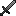
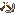
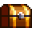
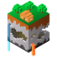
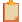
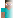
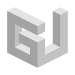
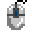
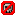
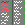

# Image credits

<table>
  <tr>
    <td><a href="booster/">&nbsp;&nbsp;booster/* </a></td>
    <td><a href="https://www.planetminecraft.com/texture-pack/88classic-8x8/">88Classic (1Allexx1)</a></td>
  </tr>
  <tr>
    <td><a href="credits/scroll.png">&nbsp;&nbsp;credits/scroll.png </a></td>
    <td><a href="https://web.archive.org/web/20221107162631/https://preview.pixlr.com/images/800wm/100/1/1001469300.jpg">Stock by Pixlr</a></td>
  </tr>
  <tr>
    <td><a href="credits/">&nbsp;&nbsp;credits/* </a></td>
    <td>selfmade</td>
  </tr>
  <tr>
    <td><a href="griefer_info/chest.png">&nbsp;&nbsp;griefer_info/chest.png </a></td>
    <td><a href="https://assets.mcasset.cloud/1.19.2/assets/minecraft/textures/entity/chest/normal.png">Minecraft asset</a></td>
  </tr>
  <tr>
    <td><a href="griefer_info/chest_gray.png">&nbsp;&nbsp;griefer_info/chest_gray.png </a></td>
    <td><a href="https://assets.mcasset.cloud/1.19.2/assets/minecraft/textures/entity/chest/normal.png">Minecraft asset</a></td>
  </tr>
  <tr>
    <td><a href="griefer_info/diamond_sword.png">&nbsp;&nbsp;griefer_info/diamond_sword.png </a></td>
    <td><a href="https://assets.mcasset.cloud/1.19.2/assets/minecraft/textures/item/diamond_sword.png">Minecraft asset</a></td>
  </tr>
  <tr>
    <td><a href="griefer_info/gray_sword.png">&nbsp;&nbsp;griefer_info/gray_sword.png  </a></td>
    <td><a href="https://assets.mcasset.cloud/1.19.2/assets/minecraft/textures/item/diamond_sword.png">Minecraft asset</a></td>
  </tr>
  <tr>
  <tr>
    <td><a href="litematica/axes.png">&nbsp;&nbsp;litematica/axes.png </a></td>
    <td>selfmade</td>
  </tr>
  <tr>
    <td><a href="litematica/green_highlight.png">&nbsp;&nbsp;litematica/green_highlight.png </a></td>
    <td>selfmade</td>
  </tr>
  <tr>
    <td><a href="litematica/litematica.png">&nbsp;&nbsp;litematica/litematica.png </a></td>
    <td><a href="https://github.com/maruohon/litematica/blob/54343aa6a4eaf71fb7a6ab38dd5c72ed3bf1b897/src/main/resources/assets/litematica/icon.png">Litematica (SuperDragonite2172)</a></td>
  </tr>
  <tr>
    <td><a href="mob_icons/faithless/">&nbsp;&nbsp;mob_icons/faithless/* </a></td>
    <td><a href="https://www.curseforge.com/minecraft/texture-packs/faithless">StitchSprites</a></td>
  </tr>
  <tr>
    <td><a href="mob_icons/minecraft/">&nbsp;&nbsp;mob_icons/minecraft/* </a></td>
    <td><a href="https://static.wikia.nocookie.net/minecraft_gamepedia/images/4/40/EntityCSS.png/revision/latest?version=1670889213562&format=png">Minecraft Fandom</a></td>
  </tr>
  <tr>
    <td><a href="mob_icons/outlined_minecraft/">&nbsp;&nbsp;mob_icons/outlined_minecraft/* </a></td>
    <td><a href="https://static.wikia.nocookie.net/minecraft_gamepedia/images/4/40/EntityCSS.png/revision/latest?version=1670889213562&format=png">Minecraft Fandom</a></td>
  </tr>
  <tr>
    <td><a href="wallets/">&nbsp;&nbsp;wallets/*  </a></td>
    <td><a href="https://www.shutterstock.com/image-vector/pixel-art-game-cash-money-icons-2197122619">Shutterstock (NSTIvectors)</a></td>
  </tr>
  <tr>
    <td><a href="arrow_circle.png">&nbsp;&nbsp;arrow_circle.png </a></td>
    <td><a href="https://labymod.net">LabyMod asset</a></td>
  </tr>
  <tr>
    <td><a href="bank.png">&nbsp;&nbsp;bank.png </a></td>
    <td><a href="https://www.dreamstime.com/126816563">Dreamstime (Starserfer)</a></td>
  </tr>
  <tr>
    <td><a href="blindness.png">&nbsp;&nbsp;blindness.png </a></td>
    <td><a href="https://assets.mcasset.cloud/1.19.2/assets/minecraft/textures/mob_effect/blindness.png">Minecraft asset</a></td>
  </tr>
  <tr>
    <td><a href="blue_graph.png">&nbsp;&nbsp;blue_graph.png </a></td>
    <td><a href="https://www.vecteezy.com/vector-art/6470596-falling-chart-pixel-art-business-icon">Vectezzy (Dooder)</a></td>
  </tr>
  <tr>
    <td><a href="blue_light_bulb.png">&nbsp;&nbsp;blue_light_bulb.png </a></td>
    <td><a href="https://www.istockphoto.com/de/vektor/472679974-63963289">iStock (karpenko_ilia)</a></td>
  </tr>
  <tr>
    <td><a href="bone_with_meat.png">&nbsp;&nbsp;bone_with_meat.png </a></td>
    <td><a href="https://assets.mcasset.cloud/1.19.2/assets/minecraft/textures/mob_effect/saturation.png">Minecraft asset</a></td>
  </tr>
  <tr>
    <td><a href="broken_lock.png">&nbsp;&nbsp;broken_lock.png </a></td>
    <td><a href="https://www.freepik.com/premium-vector/door-lock-pixel-art-set-secure-lock-made-gold-steel-locked-unlocked-collection-8bit_25184624.htm">Freepik (cadmium_red)</a></td>
  </tr>
  <tr>
    <td><a href="broken_pickaxe.png">&nbsp;&nbsp;broken_pickaxe.png </a></td>
    <td><a href="https://assets.mcasset.cloud/1.19.2/assets/minecraft/textures/gui/container/stats_icons.png">Minecraft asset</a></td>
  </tr>
  <tr>
    <td><a href="bug.png">&nbsp;&nbsp;bug.png </a></td>
    <td><a href="https://www.freepik.com/premium-vector/insects-pixel-art-set-bugs-beetles-collection-8-bit-sprite_27501189.htm">Freepik (cadmium_red)</a></td>
  </tr>
  <tr>
    <td><a href="bundle.png">&nbsp;&nbsp;bundle.png </a></td>
    <td><a href="https://assets.mcasset.cloud/1.19.2/assets/minecraft/textures/item/bundle_filled.png">Minecraft asset</a></td>
  </tr>
  <tr>
    <td><a href="calculator.png">&nbsp;&nbsp;calculator.png </a></td>
    <td><a href="https://apps.apple.com/us/app/calculator/id1069511488">Apple calculator</a></td>
  </tr>
  <tr>
    <td><a href="camera.png">&nbsp;&nbsp;camera.png </a></td>
    <td><a href="https://www.shutterstock.com/de/image-vector/movie-camera-pixel-art-32-bit-2191871743">Shutterstock (pixelpnj)</a></td>
  </tr>
  <tr>
    <td><a href="chest.png">&nbsp;&nbsp;chest.png </a></td>
    <td><a href="https://stock.adobe.com/de/images/set-of-pixel-boxes/192886298">Adobe Stock (Markov)</a></td>
  </tr>
  <tr>
    <td><a href="chunk.png">&nbsp;&nbsp;chunk.png </a></td>
    <td><a href="https://www.deviantart.com/ishmanallenlitchmore/art/chunk-of-minecraft-382711453">DeviantArt (IshmanAllenLitchmore)</a></td>
  </tr>
  <tr>
    <td><a href="clipboard.png">&nbsp;&nbsp;clipboard.png </a></td>
    <td><a href="https://www.shutterstock.com/image-vector/clipboard-icon-notes-clean-sheet-paper-1044834838?irclickid=UI71-xzgtxyPTyXQdGTcA0UnUkF1D9zJFXwjR40&irgwc=1">Shutterstock (VectorPixelStar)</a></td>
  </tr>
  <tr>
    <td><a href="cog.png">&nbsp;&nbsp;cog.png </a></td>
    <td><a href="https://www.dreamstime.com/pixel-icon-cogwheel-pixel-icon-cogwheel-three-variants-fully-editable-image123561946">Dreamstime (Starserfer)</a></td>
  </tr>
  <tr>
    <td><a href="coin_pile.png">&nbsp;&nbsp;coin_pile.png </a></td>
    <td><a href="https://www.shutterstock.com/image-vector/pixel-art-golden-coin-retro-video-1024225483">Shutterstock (Gamegfx)</a></td>
  </tr>
  <tr>
    <td><a href="command_pie_menu.png">&nbsp;&nbsp;command_pie_menu.png </a></td>
    <td><a href="https://labymod.net">LabyMod asset</a></td>
  </tr>
  <tr>
    <td><a href="cpu.png">&nbsp;&nbsp;cpu.png </a></td>
    <td><a href="https://www.shutterstock.com/image-vector/electronics-pixel-art-icons-set-artificial-1508310176">Shutterstock (VectorPixelStar)</a></td>
  </tr>
  <tr>
    <td><a href="crossed_out_camera.png">&nbsp;&nbsp;crossed_out_camera.png </a></td>
    <td><a href="https://www.shutterstock.com/de/image-vector/movie-camera-pixel-art-32-bit-2191871743">Shutterstock (pixelpnj)</a></td>
  </tr>
  <tr>
    <td><a href="crosshair.png">&nbsp;&nbsp;crosshair.png </a></td>
    <td>selfmade</td>
  </tr>
  <tr>
    <td><a href="discord.png">&nbsp;&nbsp;discord.png </a></td>
    <td><a href="https://apps.apple.com/de/app/discord-chatten-live-stream/id985746746">Discord (iOS App)</a></td>
  </tr>
  <tr>
    <td><a href="discord_clyde.png">&nbsp;&nbsp;discord_clyde.png </a></td>
    <td><a href="https://discord.com/branding">Discord</a></td>
  </tr>
  <tr>
    <td><a href="earth.png">&nbsp;&nbsp;earth.png </a></td>
    <td><a href="https://www.dreamstime.com/129325507">Dreamstime (Tsipilevin)</a></td>
  </tr>
  <tr>
    <td><a href="earth_grid.png">&nbsp;&nbsp;earth_grid.png </a></td>
    <td><a href="https://labymod.net">LabyMod asset</a></td>
  </tr>
  <tr>
    <td><a href="explorer.png">&nbsp;&nbsp;explorer.png </a></td>
    <td><a href="https://www.curseforge.com/minecraft/texture-packs/faithless">Faithless Resource Pack Asset</a></td>
  </tr>
  <tr>
    <td><a href="fading_steve.png">&nbsp;&nbsp;fading_steve.png </a></td>
    <td><a href="https://assets.mcasset.cloud/1.19.2/assets/minecraft/textures/entity/steve.png">Minecraft asset</a></td>
  </tr>
  <tr>
    <td><a href="file.png">&nbsp;&nbsp;file.png </a></td>
    <td><a href="https://stock.adobe.com/de/images/pixel-art-icon-document-file-illustration-vector/445483743">Adobe Stock (gassh)</a></td>
  </tr>
  <tr>
    <td><a href="fire.png">&nbsp;&nbsp;fire.png </a></td>
    <td><a href="https://assets.mcasset.cloud/1.19.2/assets/minecraft/textures/block/fire_0.png">Minecraft asset</a></td>
  </tr>
  <tr>
    <td><a href="glitch_light_bulb.png">&nbsp;&nbsp;glitch_light_bulb.png </a></td>
    <td><a href="https://www.istockphoto.com/de/vektor/472679974-63963289">iStock (karpenko_ilia)</a></td>
  </tr>
  <tr>
    <td><a href="glitch_question_mark.png">&nbsp;&nbsp;glitch_question_mark.png </a></td>
    <td>selfmade</td>
  </tr>
  <tr>
    <td><a href="gold_ingot.png">&nbsp;&nbsp;gold_ingot.png </a></td>
    <td><a href="https://assets.mcasset.cloud/1.19.2/assets/minecraft/textures/item/gold_ingot.png">Minecraft asset</a></td>
  </tr>
  <tr>
    <td><a href="gold_ingot_crossed_out.png">&nbsp;&nbsp;gold_ingot_crossed_out.png </a></td>
    <td><a href="https://assets.mcasset.cloud/1.19.2/assets/minecraft/textures/item/gold_ingot.png">Minecraft asset</a></td>
  </tr>
  <tr>
    <td><a href="green_particle.png">&nbsp;&nbsp;green_particle.png </a></td>
    <td><a href="https://assets.mcasset.cloud/1.8.9/assets/minecraft/textures/particle/particles.png">Minecraft asset</a></td>
  </tr>
  <tr>
    <td><a href="green_scroll.png">&nbsp;&nbsp;green_scroll.png </a></td>
    <td><a href="https://web.archive.org/web/20221107162631/https://preview.pixlr.com/images/800wm/100/1/1001469300.jpg">Stock by Pixlr</a></td>
  </tr>
  <tr>
    <td><a href="griefer_info.png">&nbsp;&nbsp;griefer_info.png </a></td>
    <td><a href="https://www.griefer.info/img/block.png">GrieferInfo</a></td>
  </tr>
  <tr>
    <td><a href="hourglass.png">&nbsp;&nbsp;hourglass.png </a></td>
    <td><a href="https://stock.adobe.com/de/310886492">Adobe Stock (Ksenia)</a></td>
  </tr>
  <tr>
    <td><a href="icon.png">&nbsp;&nbsp;icon.png </a></td>
    <td>selfmade</td>
  </tr>
  <tr>
    <td><a href="info.png">&nbsp;&nbsp;info.png </a></td>
    <td><a href="https://minecraft-heads.com/custom-heads/alphabet/24498">Minecraft Heads (Kiaria)</a></td>
  </tr>
  <tr>
    <td><a href="key.png">&nbsp;&nbsp;key.png </a></td>
    <td><a href="https://betterttv.com/emotes/5c857788f779543bcdf37124">BetterTTV (CoobieXD)</a></td>
  </tr>
  <tr>
    <td><a href="left_click.png">&nbsp;&nbsp;left_click.png </a></td>
    <td><a href="https://labymod.net">LabyMod asset</a></td>
  </tr>
  <tr>
    <td><a href="lens.png">&nbsp;&nbsp;lens.png </a></td>
    <td><a href="https://www.shutterstock.com/image-vector/772538452">Shutterstock (VectorPixelStar)</a></td>
  </tr>
  <tr>
    <td><a href="light_bulb.png">&nbsp;&nbsp;light_bulb.png </a></td>
    <td><a href="https://www.istockphoto.com/de/vektor/472679974-63963289">iStock (karpenko_ilia)</a></td>
  </tr>
  <tr>
    <td><a href="lightning.png">&nbsp;&nbsp;lightning.png </a></td>
    <td><a href="https://www.freepik.com/premium-vector/vector-illustration-cute-pixel-art-icon-geek-lightning-element-style-90s-game_29366701.htm">Freepik (Olive Kitt)</a></td>
  </tr>
  <tr>
    <td><a href="lock.png">&nbsp;&nbsp;lock.png </a></td>
    <td><a href="https://www.freepik.com/premium-vector/door-lock-pixel-art-set-secure-lock-made-gold-steel-locked-unlocked-collection-8bit_25184624.htm">Freepik (cadmium_red)</a></td>
  </tr>
  <tr>
    <td><a href="long_speech_bubble.png">&nbsp;&nbsp;long_speech_bubble.png </a></td>
    <td>selfmade</td>
  </tr>
  <tr>
    <td><a href="magnifying_glass.png">&nbsp;&nbsp;magnifying_glass.png </a></td>
    <td><a href="https://labymod.net">LabyMod asset</a></td>
  </tr>
  <tr>
    <td><a href="matrix.png">&nbsp;&nbsp;matrix.png </a></td>
    <td>selfmade</td>
  </tr>
  <tr>
    <td><a href="maximize.png">&nbsp;&nbsp;maximize.png </a></td>
    <td>selfmade</td>
  </tr>
  <tr>
    <td><a href="measurement_circle_thingy.png">&nbsp;&nbsp;measurement_circle_thingy.png </a></td>
    <td><a href="https://labymod.net">LabyMod asset</a></td>
  </tr>
  <tr>
    <td><a href="middle_click.png">&nbsp;&nbsp;middle_click.png </a></td>
    <td><a href="https://labymod.net">LabyMod asset</a></td>
  </tr>
  <tr>
    <td><a href="mouse.png">&nbsp;&nbsp;mouse.png </a></td>
    <td><a href="https://labymod.net">LabyMod asset</a></td>
  </tr>
  <tr>
	<!-- https://d1fdloi71mui9q.cloudfront.net/IBa9YlxRAOTxKwqdO1LA_zGa80ENAU97bC0AU -->
    <td><a href="mysterymod.png">&nbsp;&nbsp;mysterymod.png </a></td>
    <td><a href="https://linktr.ee/MysteryMod">Mysterymod</a></td>
  </tr>
  <tr>
    <td><a href="one_player_plaque.png">&nbsp;&nbsp;one_player_plaque.png </a></td>
    <td><a href="https://labymod.net">LabyMod asset</a></td>
  </tr>
  <tr>
    <td><a href="open_book.png">&nbsp;&nbsp;open_book.png </a></td>
    <td><a href="https://stock.adobe.com/es/images/different-books-pixel-art-set-fantasy-tome-folio-collection-open-closed-textbooks-8-bit-sprite-game-development-mobile-app-isolated-vector-illustration/502502076">Adobe Stock (SickleMoon)</a></td>
  </tr>
  <tr>
    <td><a href="open_book_outline.png">&nbsp;&nbsp;open_book_outline.png </a></td>
    <td><a href="https://stock.adobe.com/es/images/different-books-pixel-art-set-fantasy-tome-folio-collection-open-closed-textbooks-8-bit-sprite-game-development-mobile-app-isolated-vector-illustration/502502076">Adobe Stock (SickleMoon)</a></td>
  </tr>
  <tr>
    <td><a href="open_link.png">&nbsp;&nbsp;open_link.png </a></td>
    <td>selfmade</td>
  </tr>
  <tr>
    <td><a href="orb.png">&nbsp;&nbsp;orb.png </a></td>
    <td><a href="https://www.deviantart.com/bronzefish678/art/Pixel-orb-thing-245073608">DeviantArt (bronzefish678)</a></td>
  </tr>
  <tr>
    <td><a href="orbseller.png">&nbsp;&nbsp;orbseller.png </a></td>
    <td><a href="https://textures.minecraft.net/texture/ef686fbf016e1458f7f9a9850f38ef7fd6ae1d28bc241ac0c0686f77fdbb4b61">Minecraft Skin</a></td>
  </tr>
  <tr>
    <td><a href="pencil.png">&nbsp;&nbsp;pencil.png </a></td>
    <td><a href="https://www.pinterest.de/pin/151081762469399143/">Pinterest (Jason Robb)</a></td>
  </tr>
  <tr>
    <td><a href="player_menu.png">&nbsp;&nbsp;player_menu.png </a></td>
    <td><a href="https://labymod.net">LabyMod asset</a></td>
  </tr>
  <tr>
    <td><a href="portal.png">&nbsp;&nbsp;portal.png </a></td>
    <td><a href="https://assets.mcasset.cloud/1.19.2/assets/minecraft/textures/block/nether_portal.png">Minecraft asset</a></td>
  </tr>
  <tr>
    <td><a href="qr_code.png">&nbsp;&nbsp;qr_code.png </a></td>
    <td>selfmade</td>
  </tr>
  <tr>
    <td><a href="radar.png">&nbsp;&nbsp;radar.png </a></td>
    <td><a href="https://walternewton.tumblr.com/64762433376">Debut Art (Walter Newton)</a></td>
  </tr>
  <tr>
    <td><a href="rainbow_name.png">&nbsp;&nbsp;rainbow_name.png </a></td>
    <td><a href="https://labymod.net">LabyMod asset</a></td>
  </tr>
  <tr>
    <td><a href="recording.png">&nbsp;&nbsp;recording.png </a></td>
    <td>selfmade</td>
  </tr>
  <tr>
    <td><a href="red_scroll.png">&nbsp;&nbsp;red_scroll.png </a></td>
    <td><a href="https://web.archive.org/web/20221107162631/https://preview.pixlr.com/images/800wm/100/1/1001469300.jpg">Stock by Pixlr</a></td>
  </tr>
  <tr>
    <td><a href="regex.png">&nbsp;&nbsp;regex.png </a></td>
    <td><a href="https://github.com/gskinner/regexr/blob/98a0d9332cbd86cfe958232b4664ab4afff03b9b/assets/icons/android-chrome-512x512.png">RegExr (gskinner)</a></td>
  </tr>
  <tr>
    <td><a href="rocket.png">&nbsp;&nbsp;rocket.png </a></td>
    <td><a href="https://www.redbubble.com/de/i/sticker/Pixel-Raketenschiff-auf-Wei%C3%9F-von-Rocket-To-Pluto/53450460.EJUG5">Rocket-To-Pluto</a></td>
  </tr>
  <tr>
    <td><a href="ruler.png">&nbsp;&nbsp;ruler.png </a></td>
    <td>selfmade</td>
  </tr>
  <tr>
    <td><a href="scroll.png">&nbsp;&nbsp;scroll.png </a></td>
    <td><a href="https://web.archive.org/web/20221107162631/https://preview.pixlr.com/images/800wm/100/1/1001469300.jpg">Stock by Pixlr</a></td>
  </tr>
  <tr>
    <td><a href="shield_with_sword.png">&nbsp;&nbsp;shield_with_sword.png </a></td>
    <td><a href="https://assets.mcasset.cloud/1.19.2/assets/minecraft/textures/mob_effect/resistance.png">Minecraft asset</a></td>
  </tr>
  <tr>
    <td><a href="skull_crossed_out.png">&nbsp;&nbsp;skull_crossed_out.png </a></td>
    <td><a href="https://www.planetminecraft.com/texture-pack/88classic-8x8/">88Classic (1Allexx1)</a></td>
  </tr>
  <tr>
    <td><a href="sneaking.png">&nbsp;&nbsp;sneaking.png </a></td>
    <td><a href="https://minecraft.wiki/images/Sneaking_Alex.png?7e51d">Minecraft Wiki</a></td>
  </tr>
  <tr>
    <td><a href="spawner.png">&nbsp;&nbsp;spawner.png </a></td>
    <td><a href="https://minecraft.wiki/images/thumb/Spawner_with_fire.png/150px-Spawner_with_fire.png?01b06">Minecraft Wiki</a></td>
  </tr>
  <tr>
    <td><a href="speech_bubble.png">&nbsp;&nbsp;speech_bubble.png </a></td>
    <td>selfmade</td>
  </tr>
  <tr>
    <td><a href="speed.png">&nbsp;&nbsp;speed.png </a></td>
    <td><a href="https://assets.mcasset.cloud/1.19.2/assets/minecraft/textures/mob_effect/speed.png">Minecraft asset</a></td>
  </tr>
  <tr>
    <td><a href="spyglass.png">&nbsp;&nbsp;spyglass.png </a></td>
    <td><a href="https://assets.mcasset.cloud/1.19.2/assets/minecraft/textures/item/spyglass.png">Minecraft asset</a></td>
  </tr>
  <tr>
    <td><a href="steve.png">&nbsp;&nbsp;steve.png </a></td>
    <td><a href="https://assets.mcasset.cloud/1.19.2/assets/minecraft/textures/entity/steve.png">Minecraft asset</a></td>
  </tr>
  <tr>
    <td><a href="steve_creeper.png">&nbsp;&nbsp;steve_creeper.png </a></td>
    <td><a href="https://assets.mcasset.cloud/1.19.2/assets/minecraft/textures/entity/steve.png">Minecraft asset</a></td>
  </tr>
  <tr>
    <td><a href="stone.png">&nbsp;&nbsp;stone.png </a></td>
    <td><a href="https://assets.mcasset.cloud/1.19.2/assets/minecraft/textures/block/stone.png">Minecraft asset</a></td>
  </tr>
  <tr>
    <td><a href="tab_list.png">&nbsp;&nbsp;tab_list.png </a></td>
    <td><a href="https://labymod.net">LabyMod asset</a></td>
  </tr>
  <tr>
    <td><a href="thonk.png">&nbsp;&nbsp;thonk.png  </a></td>
    <td><a href="https://cdn.discordapp.com/emojis/1075141032284524564.webp?size=128&quality=lossless">Discord emoji</a></td>
  </tr>
  <tr>
    <td><a href="tree_file.png">&nbsp;&nbsp;tree_file.png </a></td>
    <td><a href="https://labymod.net">LabyMod asset</a></td>
  </tr>
  <tr>
    <td><a href="twitch.png">&nbsp;&nbsp;twitch.png </a></td>
    <td><a href="https://www.twitch.tv/p/press-center/">Twitch</a></td>
  </tr>
  <tr>
    <td><a href="webhook.png">&nbsp;&nbsp;webhook.png </a></td>
    <td><a href="https://de.cleanpng.com/png-agix7q">Cleanpng</a></td>
  </tr>
  <tr>
    <td><a href="white_griefer_info.png">&nbsp;&nbsp;white_griefer_info.png </a></td>
    <td><a href="https://www.griefer.info/img/block.png">GrieferInfo</a></td>
  </tr>
  <tr>
    <td><a href="white_scroll.png">&nbsp;&nbsp;white_scroll.png </a></td>
    <td><a href="https://web.archive.org/web/20221107162631/https://preview.pixlr.com/images/800wm/100/1/1001469300.jpg">Stock by Pixlr</a></td>
  </tr>
  <tr>
    <td><a href="wooden_board.png">&nbsp;&nbsp;wooden_board.png </a></td>
    <td><a href="https://labymod.net">LabyMod asset</a></td>
  </tr>
  <tr>
    <td><a href="wrench_screwdriver.png">&nbsp;&nbsp;wrench_screwdriver.png </a></td>
    <td><a href="https://www.shutterstock.com/image-vector/wrench-screwdriver-pixel-art-settings-icon-773305213">Shutterstock (VectorPixelStar)</a></td>
  </tr>
  <tr>
    <td><a href="yellow_name.png">&nbsp;&nbsp;yellow_name.png </a></td>
    <td><a href="https://labymod.net">LabyMod asset</a></td>
  </tr>
  <tr>
    <td><a href="yellow_t.png">&nbsp;&nbsp;yellow_t.png </a></td>
    <td>selfmade</td>
  </tr>
</table>
